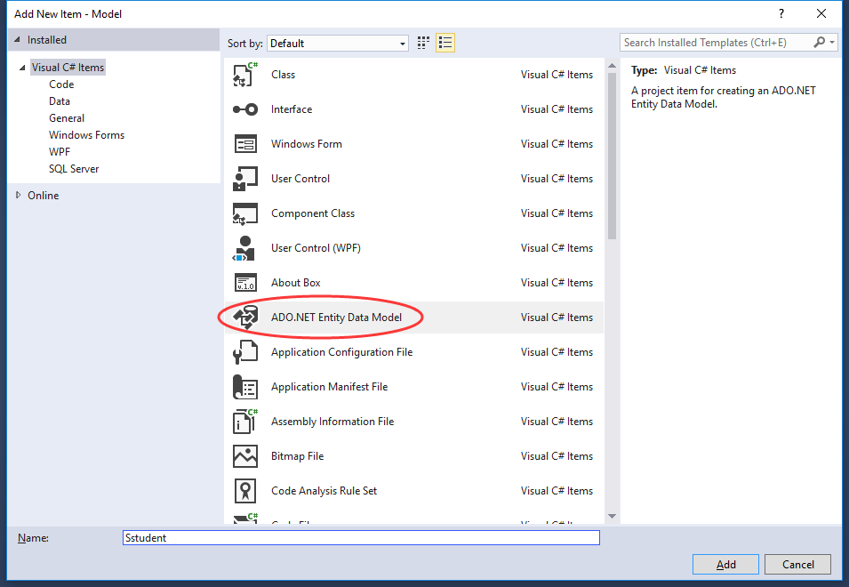
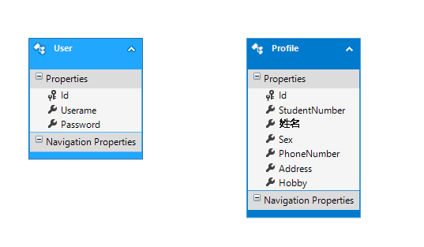
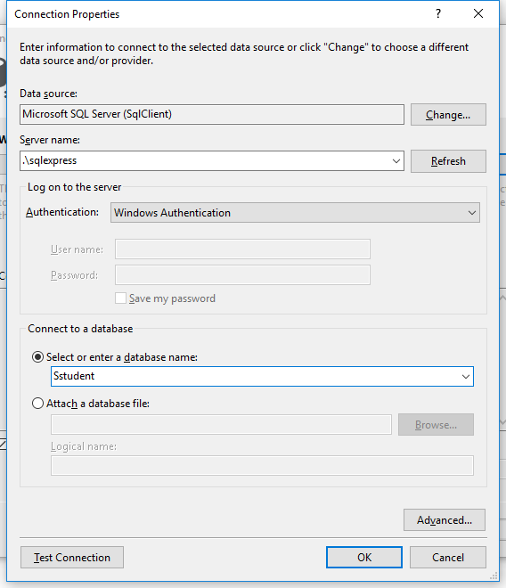
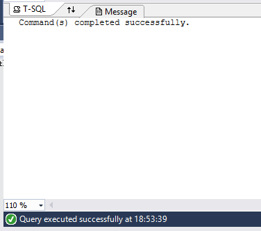
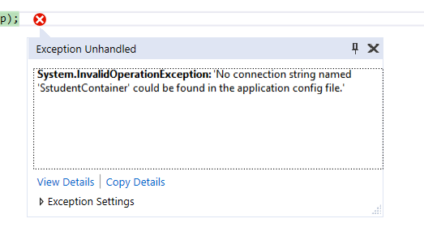

# Entity Framework 新手入门友好实例

> 此为原本写在 cnblogs 的[一篇博客](http://www.cnblogs.com/hiwangzi/p/EntityFrameworkSample.html)。

<!-- TOC -->

- [Entity Framework 新手入门友好实例](#entity-framework-新手入门友好实例)
    - [起因](#起因)
    - [简介](#简介)
    - [实例演示](#实例演示)
        - [数据实体](#数据实体)
        - [具体步骤](#具体步骤)
            - [1. 新建一个名为 Sstudent 的 WinForm 程序项目](#1-新建一个名为-sstudent-的-winform-程序项目)
            - [2. 新建一个名为 Model 的类库项目（可选）](#2-新建一个名为-model-的类库项目可选)
            - [3. 新增一个名为 Sstudent 的 ADO.NET Entity Data Model](#3-新增一个名为-sstudent-的-adonet-entity-data-model)
            - [4. 下面来说一说如何通过创建的模型来访问数据库](#4-下面来说一说如何通过创建的模型来访问数据库)
    - [补充](#补充)

<!-- /TOC -->

## 起因

因为实习的原因，程序之中用到了较多的数据库操作逻辑。如果每一处数据库操作都手写的话，工作量较大且后期不易于维护，所以希望能通过 ORM 框架来解决这两个问题。

在昨天之前，对于 ORM 这个词汇，我也仅仅只是在上个学期的 Java EE 课上看企业老师“神速”地使用 Hibernate 做了建立数据库、插入数据的演示。

这两天花了很多时间了解 Entity Framework，终于在今晚成功地实现了“查插删改”，中间经过了很多的波折。例如：查找的很多资料提供的代码都是不完整的，同时他们的讲解也不够“新人（菜鸟）友好型”。所以我决定把一个简单的实例的具体步骤写出来，帮助像我这样的菜鸟快速将 EF(Entity Framework) 应用起来。

如果博文有不当之处，欢迎指出，谢谢~

## 简介

首先是两个概念

* [对象关系映射](https://zh.wikipedia.org/wiki/%E5%AF%B9%E8%B1%A1%E5%85%B3%E7%B3%BB%E6%98%A0%E5%B0%84)（英语：Object Relational Mapping，简称 ORM，或 O/RM，或 O/R mapping），是一种程序设计技术，用于实现面向对象编程语言里不同类型系统的数据之间的转换。简单来说，就是可以把一条数据库记录转换为程序中的一个对象，或者反向转换，当然实际上 ORM 可以做更多的事情。）

* [Entity Framework](https://zh.wikipedia.org/wiki/Entity_Framework) (又称 ADO.NET Entity Framework) 是微软以 ADO.NET 为基础所发展出来的对象关系对应 (O/R Mapping) 解决方案。

使用 Entity Framework 在实际数据库相关代码开发中可以采取三种方式：

* DB First：先开发数据库，然后借助 Visual Studio 将数据库中的表结构（或视图）转换为程序中实体模型类。
* Code First：直接在程序中定义实体模型类，然后借助 Visual Studio 将其转换为数据库中的表。
* Model First：借助 Visual Studio 中的可视化设计工具，设计好数据模型（可以理解为E-R图），然后转换为数据库中的表。

本实例采用第三种方式，即 Model First。

## 实例演示

本实例使用的是 Visual Studio 2017(Community)，通过一个 WinForm 程序访问 SQL Server 2016(Express) 数据库来演示。

本程序可以实现学生信息的自我维护，包括对用户名、密码、性别、班级、电话等资料的处理。学生可以填写信息注册账号，然后使用账号登录查看自己的信息，并对自己的信息进行修改。

演示：


### 数据实体

两个实体：

* 用户（用户名，密码）

* 个人资料（学号，姓名，性别，电话，地址，爱好）


### 具体步骤

#### 1. 新建一个名为 Sstudent 的 WinForm 程序项目

#### 2. 新建一个名为 Model 的类库项目（可选）

  

#### 3. 新增一个名为 Sstudent 的 ADO.NET Entity Data Model

  

  

* 3.1 在向导中选择空的实体设计器模型

  

* 3.2 然后就可以开始创建自己的实体模型

  

  

  * 这里首先从工具栏拖出两个 Entity 。

    

  * 此时我们观察一下属性区，这里有两项比较重要的属性，如下图

    

  * 其中 Name 可以理解为对应将来的数据库表中的一条记录的名字，Entity Set Name 对应的则是一张表的名字。这里修改一下，即用户表（或用户集，UserSet）中会有多条用户记录（User）。

    

  * 再来观察一下实体中的属性，在我们创建 Entity 的时候，会自动产生一个名为 Id 的非空自增实体键，如下图所示。

    

  * 现在我们完善一下两个实体的属性，这里为了简便，所有的属性都设置为了 String 类型，对应到数据库即为 nvarchar(MAX)。这里其中一个属性用中文命名是想说明，C# 对中文是完全支持的。

    

  * 在完成了实体的创建之后，下一步进行实体之间关系的创建，同样从工具栏中拖出一个关系到两个实体之间，因为用户与个人资料之间的关系是 1对1，所以选中关系后，在属性区修改其对应关系。

    

  * 然后，在操作区点击右键，选择从模型生成数据库，根据指引，即可完成数据库的建立。

    

  * 如果之前没有数据库连接的话，点击“新建连接”选项，按照你的需求选择，这里选择 SQL Server，输入相关信息后，即可完成连接的建立。

    

    

    

  * 补充：如果此处输入的数据库名不存在，会自动创建对应数据库。

    

  * 然后按照提示，可以得到自动生成的 SQL 文件，点击绿色按钮执行即可（此处同样要求输入数据库的账号密码）。

    

    

    

  * 在完成创建后，到SQL Server Management Studio 中查看数据库即可发现，表已经被创建。

    

  * 因为实体之间是 1对1 的关系，所以不会创建新的关系表，而是将其中一张表的主键附加到另一张表中，如下图所示。

    

#### 4. 下面来说一说如何通过创建的模型来访问数据库

* 4.1 先来看一下 EF 框架帮我们创建的文件，如下图所示。

  

* 4.2 我们新建一个名为 UI 的项目，用于展现界面与接受用户操作。因为本项目同样直接使用 EF 框架，所以在此项目中也需要引用 Entity Framework，同时引用 Model 项目。

  * (1) 使用 Nuget 引用 Entity Framework。

    

    

  * (2) 引用同解决方案的另一个项目 Model。

    

    

  * (3) 然后就可以方便地如下图所示一般使用“数据库”了，下图所示为两个实体对象集（可理解为数据表）。

    

* 4.3 通过 EF 框架实现查询功能。

```CS
// 登录
private void button_Login_Click(object sender, EventArgs e)
{
    // 使用 EF 框架实现查询
    User u=sstudentContainer.UserSet.Where(user => user.Userame == textBox_Username.Text && user.Password == textBox_Password.Text).FirstOrDefault();
    // 如果查询不到，会返回 null
    if (u != null)
    {
        new MyProfile(u).Show();
        this.Hide();
    }
    else
    {
        MessageBox.Show("用户名或密码错误，请重试！");
    }
}
```

* 4.4 通过 EF 框架实现插入功能。

```CS
// 注册
private void button_Signup_Click(object sender, EventArgs e)
{
    try
    {
        // 使用 EF 框架实现添加新数据功能
        User u = new User();
        Profile p = new Profile();

        u.Password = this.textBox_Password.Text;
        u.Userame = this.textBox_Username.Text;

        p.Address = this.textBox_Address.Text;
        p.Hobby = this.textBox_Hobby.Text;
        p.PhoneNumber = this.textBox_PhoneNumber.Text;
        p.Sex = this.textBox_Sex.Text;
        p.StudentNumber = this.textBox_StudentNumber.Text;
        p.姓名 = this.textBox_FullName.Text;

        u.Profile = p;

        // 添加两个新对象分别进入两张表
        sstudentContainer.UserSet.Add(u);
        // 因为 EF 会自动将关联的对象同时加入数据库，所以无需手动增加
        //sstudentContainer.ProfileSet.Add(p);

        // 保存新增记录进入数据库
        sstudentContainer.SaveChanges();

        MessageBox.Show("注册成功！");

        this.Close();
    }
    catch (Exception)
    {
        MessageBox.Show("抱歉，注册失败！");
        throw;
    }
}
```

* 4.5 通过 EF 框架实现删除功能。

```CS
// 删除用户所有资料
private void button_Delete_Click(object sender, EventArgs e)
{
    // 使用 EF 框架实现删除数据
    try
    {
        // 需要首先使用 sstudentContainer 查找到该项记录（对象），然后将其删除
        User u = sstudentContainer.UserSet.Where(user => user.Id == this.user.Id).FirstOrDefault();
        Profile p = u.Profile;

        // 删除用户
        sstudentContainer.ProfileSet.Remove(p);
        sstudentContainer.UserSet.Remove(u);

        // 保存删除操作进入数据库
        sstudentContainer.SaveChanges();

        MessageBox.Show("再见，删除成功！");

        this.Close();
    }
    catch (Exception)
    {
        // 发生异常，删除失败
        MessageBox.Show("抱歉，删除失败！");
        throw;
    }
}
```

* 4.6 通过 EF 框架实现更新功能。

```CS
// 更新用户资料
private void button_Update_Click(object sender, EventArgs e)
{
    // 使用 EF 框架实现更新数据
    try
    {
        // 需要首先使用 sstudentContainer 查找到该项记录（对象），然后对其进行修改
        User u = sstudentContainer.UserSet.Where(user => user.Id == this.user.Id).FirstOrDefault();
        Profile p = u.Profile;

        u.Password = this.textBox_Password.Text;
        u.Userame = this.textBox_Username.Text;

        p.Address = this.textBox_Address.Text;
        p.Hobby = this.textBox_Hobby.Text;
        p.PhoneNumber = this.textBox_PhoneNumber.Text;
        p.Sex = this.textBox_Sex.Text;
        p.StudentNumber = this.textBox_StudentNumber.Text;
        p.姓名 = this.textBox_FullName.Text;

        // 保存更改进入数据库
        sstudentContainer.SaveChanges();

        MessageBox.Show("更新资料成功！");
    }
    catch (Exception)
    {
        // 发生异常，更新失败
        MessageBox.Show("更新资料失败！");
        throw;
    }

}
```

* 4.7 当我们尝试运行程序的时候，会发现出现异常，这是因为在 UI 项目中缺少了数据库连接字符串，即下图中的选中部分。只要将其复制，即可。

  

  

## 补充

EF 能帮我们做的事情还有很多，例如可以方便快捷地通过 ToList() 方法直接将数据库中所有数据转换为对象List。而本文只是一个简单的入门实例，只是仅仅帮助初次接触 EF 摸不到头脑的新手快速实战应用，需要学习的还有很多。如果本文有任何错误或不当之处，敬请指出，共同进步，谢谢~

附上源代码：

* [ZIP 压缩包格式（附带EF依赖）](http://files.cnblogs.com/files/hiwangzi/Sstudent.zip)
* [GitHub 链接](./resources/)

补充一个不错的视频（但是其中的实例演示并没有成功）：

[Entity Framework 實戰技巧 - YouTube](https://www.youtube.com/watch?v=hbOJjjDyZIA)

Code First 实例可以参考：

[Entity Framework(EF) Code First 多对多关系的实体增，删，改，查操作全程详细示例](https://segmentfault.com/a/1190000004152660)

其他可能对你有帮助的链接：

1. [ORM框架之EntityFramework介绍](http://www.jianshu.com/p/ce8026992275)

2. [Entity(Ado.net) - zezhi821的专栏](http://blog.csdn.net/zezhi821/article/category/1072082)