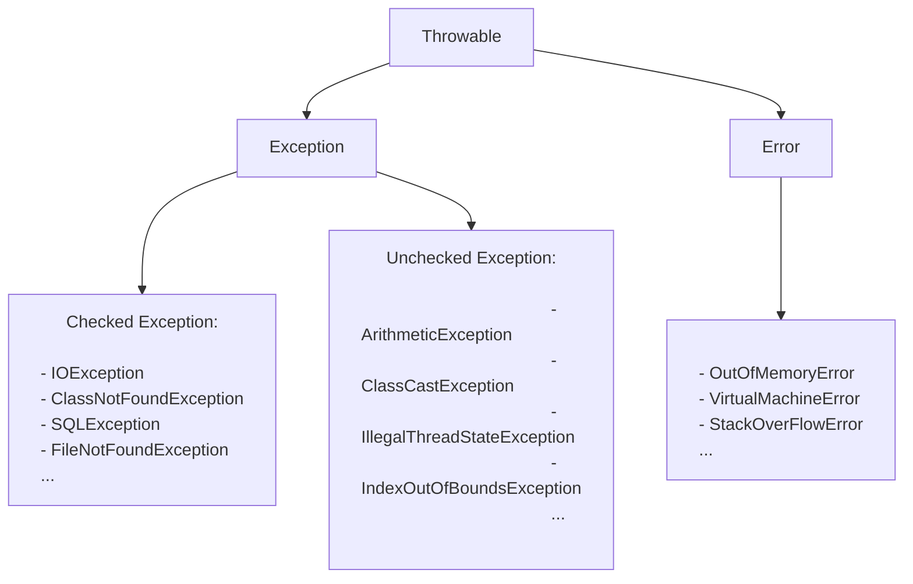

* 除了 `RuntimeException` 及其子类之外，其他的 `Exception` 类及其子类都属于受检查异常。常见的受检异常有：IO相关、`ClassNotFoundException`、`SQLException`。
* `RuntimeException` 及其子类都是非受检异常，常见的有：
  * `NullPointerException`
  * `IllegalArgumentException`
  * `NumberFormatException`：`IllegalArgumentException`的子类
  * `ArrayIndexOutOfBoundsException`
  * `ClassCastException`
  * `ArithmeticException`
  * `SecurityException`：例如权限不足
  * `UnsupportedOperationException`
* 不要在 `finally` 语句块中使用 `return`，会导致 `try` 语句块中的 `return` 被忽略。
