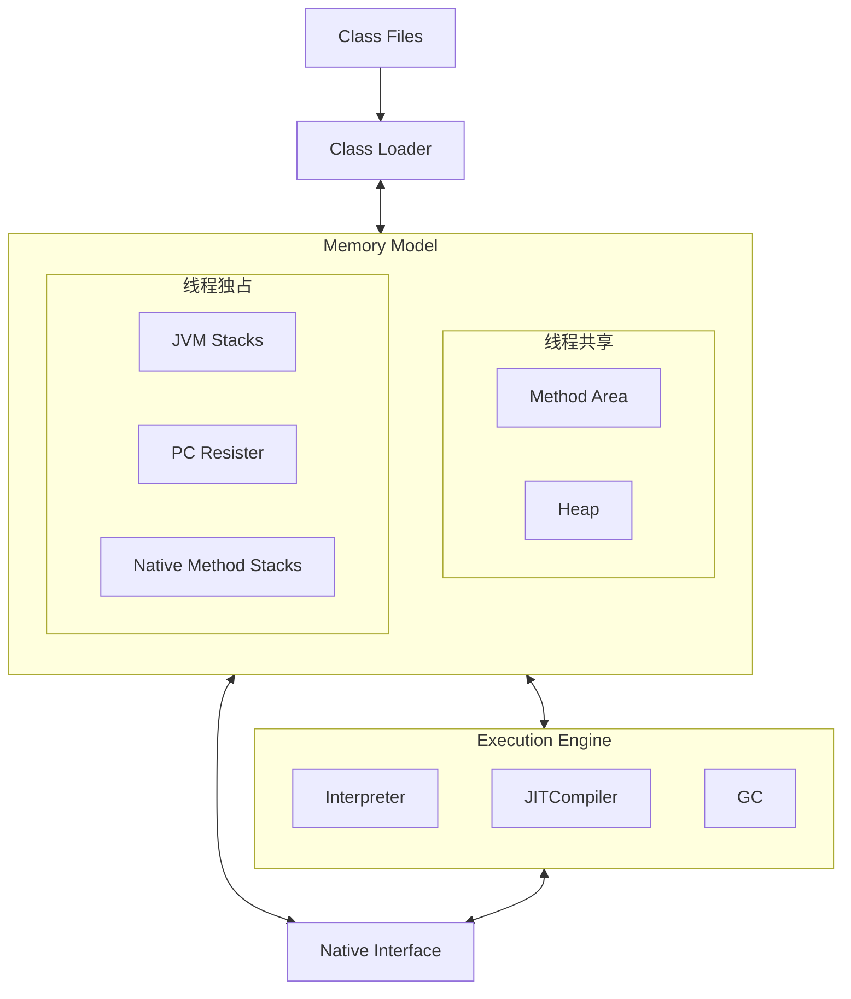
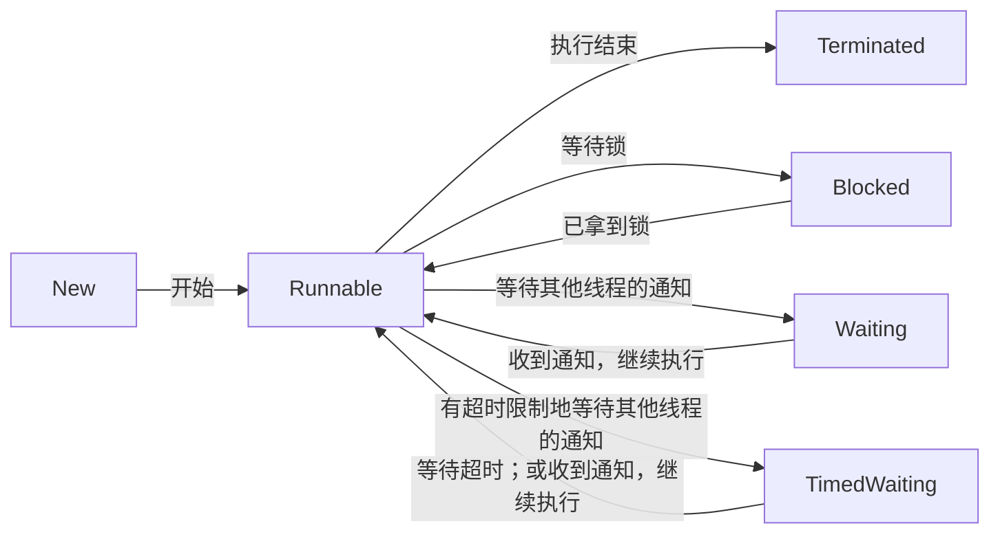

## JVM 整体结构

JVM 有多种实现，以下是 HotSpot 的设计。



### 线程共享：所有线程都能访问这部分内存，随着虚拟机或者GC而创建和销毁

* `Method Area`: JVM用来存储加载类信息、常量、静态变量、编译后的代码等数据。
    * 在虚拟机规范中这是一个逻辑分区，具体的实现根据不同的虚拟机来实现。
    * <details><summary>Java 7 HotSpot 虚拟机的方法区在永久代（Perm
      Gen），Java 8 中在元数据空间（MetaSpace），并通过 GC 机制对这个区域进行管理。</summary>
      <br><ul style="list-style-type: square">
      <li>永久代是Java堆的一部分，但元空间实际上并不是堆内存的一部分。</li>
      <li>在Java 8之前，永久代（Perm Gen）是Java堆内存的一部分，主要用于存储类的元数据、常量、静态变量等信息。当永久代满了，将会触发Full
      GC，甚至可能会抛出<code>java.lang.OutOfMemoryError: PermGen space</code>错误。</li>
      <li>然而，在Java 8中，这个概念发生了变化。永久代被移除，取而代之的是元空间（MetaSpace）。元空间不再位于堆内存中，而是直接使用本地（Native）内存。因此，元空间的大小受到本地内存的限制。当元空间内存不足时，会抛出<code>java.lang.OutOfMemoryError: MetaSpace</code>错误。</li>
      <li><details><summary>这样做的优点之一是，字符串常量池（String Pool）被移至堆内存，这使得它可以受益于垃圾回收，而不像以前那样容易导致内存溢出。</summary><br>
        在Java 7之前，字符串常量池（String Pool）是存储在永久代（PermGen）中的。因为永久代的空间相对较小，所以如果你的应用创建了大量的字符串，特别是在使用String.intern()方法时，可能会很快填满永久代，导致OutOfMemoryError: PermGen space错误。<br>
        从Java 7开始，Java的设计者决定将字符串常量池从永久代移动到堆内存中。这样做的主要原因是允许更灵活的内存管理。因为堆内存通常比永久代大得多，所以将字符串常量池移动到堆内存可以避免由于字符串常量池过大导致的内存溢出错误。此外，因为垃圾收集器在堆内存中运行，所以不再使用的字符串可以被垃圾收集器回收，这在永久代中是不可能的。<br>
        在Java 8中，永久代被完全移除，取而代之的是元空间（MetaSpace）。然而，这并没有影响字符串常量池的位置，它仍然在堆内存中。<br>
        因此，虽然字符串常量池、永久代和元空间在某种程度上有关联，但它们是独立的概念，有各自的内存管理和垃圾回收策略。<br><br></details></li>
      </ul><br>
      </details>

* `Heap`: JVM 启动时创建，存放对象的实例。
    * 垃圾回收器主要管理的就是堆内存这部分空间。如果满了，会出现 `OutOfMemoryError`。
    * <details><summary><b>Heap</b> 被进一步划分为不同的区域，主要包括<i>新生代（Young Generation）</i>和<i>老年代（Old Generation）</i>。</summary>
        <br>这种内存布局是基于一个观察结果：大多数对象在创建后不久就会变得无用。这就是所谓的"弱分代假说（Weak Generation Hypothesis）"，Java的内存管理策略就是基于这个假设的。<br><br>
      </details>
    * <details><summary><b>新生代（Young Generation）</b> 被进一步划分为三个区域：Eden 区和两个 Survivor 区（通常称为From Survivor和To Survivor或者S0，S1）。</summary>
        <br><ul style="list-style-type: square">
        <li>Eden 区：新创建的对象首先被分配到Eden 区。如果 Eden 区已满，就会触发一次 Minor GC（小型垃圾收集）。</li>
        <li>Survivor 区：Minor GC 会清理 Eden 区和一个 Survivor 区，将还存活的对象移动到另一 Survivor 区。如果对象在 Survivor 区经过一定次数的 GC 仍然存活，就会被晋升到老年代。</li>
        </ul><br>
      </details>
    * <details><summary><b>老年代（Old Generation）</b>主要用来存储长期存活的对象。</summary>
        <br>当老年代区域满了，就会发生Major GC（也称为Full GC）。Full GC会比Minor GC更耗时，因为它需要检查整个堆内存。<br><br>
      </details>

### 线程独享：每个线程都有独立的空间，随着线程的生命周期创建和销毁。

* `JVM Stacks`: 每个线程在这个空间有一个私有的空间，是为了 JVM 执行 Java 方法而准备的。
    * Stack 由多个 Stack Frame 组成。
    * 一个线程会执行一个或多个方法，一个方法就对应一个 Stack Frame。
    * Stack Frame 包含：局部变量表、操作数栈、动态链接、方法返回地址、附加信息等。
    * 栈内存默认最大是 1M，超出则会抛出 `StackOverFlowError`。
* `Native Method Stacks`: 和JVM Stacks功能类似，只是本地方法栈是为JVM使用Native方法而准备的。
    * 虚拟机规范没有规定具体的实现，由不同的虚拟机厂商去实现。
    * HotSpot 虚拟机中虚拟机栈和本地方法栈的实现是一样的。超出大小后也会抛出 `StackOverFlowError`。
* `Program Counter Register`: 记录当前线程执行字节码的位置，存储的是字节码指令地址，如果执行 Native 方法，则计数器值为空。
    * 每个线程都在这个空间又一个私有的空间，占用内存空间很少。
    * CPU 同一时间，只会执行一条线程中的指令。JVM 多线程会轮流切换并分配 CPU 执行时间，为了在线程切换之后，恢复到正确的执行位置，所以需要程序计数器。

## 并发编程基础

* 进程是代码在数据集合上的一次运行活动，是系统进行资源分配和调度的基本单位，线程则是进程的一个执行路径，一个进程中至少有一个线程，进程中的多个线程共享进程的资源。
* 操作系统在分配资源时是把资源分配给进程的，但是CPU资源比较特殊，它是被分配到线程的，因为真正要占用CPU运行的是线程，所以也说线程是CPU分配的基本单位。
* 如果按照线程独占与否划分，可以把上面的 JVM 整体结构中内存部分简化如下：
    ```mermaid
    flowchart
        subgraph Process
            direction TB
            Heap
            Method[Method Area]
        end
        subgraph Thread1
            PC1
            Stack1
        end
        subgraph Thread2
            PC2
            Stack2
        end
        Process <--> Thread1
        Process <--> Thread2
    ```
    * 多个线程共享进程的堆和方法区资源，但是**每个线程有自己的程序计数器和栈区域**。 程序计数器是一块内存区域，用来记录线程当前要执行的指令地址。
    * 堆是一个进程中最大的一块内存，堆是被进程中的所有线程共享的，是进程创建时分配的，堆里面主要存放使用new操作创建的对象实例。
    * 方法区则用来存放JVM加载的类、常量及静态变量等信息，也是线程共享的。

### 线程状态
6种线程状态定义：`java.lang.Thread.State`

* `New`：尚未启动的线程的线程状态
* `Runnable`：可运行线程的线程状态，等待CPU调度
* `Blocked`：线程阻塞，等待监视器锁的线程状态
* `Waiting`: 等待线程。不带超时的方法：`Object.wait`, `Thread.join`, `LockSupport.park`。
* `Timed Waiting`:
  具有指定等待时间的等待线程。带超时的方法：`Thread.sleep`, `Object.wait`, `Thread.join`, `LockSupport.parkNanos`, `LockSupport.parkUntil`
* `Terminated`：线程终止



* 终止线程
    * `stop()` 方法可能造成非原子化操作，已经被标记为 `@Deprecated`
    * 使用 `interrupt()` 方法，可以通知到要被终止的线程（接收到异常或主动检测 `while(!isInterrupted())`
      ），在其内部可以编写代码正确处理数据
        ```java
        public class InterruptDemo {
            public static void main(String[] args) throws InterruptedException {
                var thread = new Thread(() -> {
                    try {
                        while (!Thread.currentThread().isInterrupted()) { // 判断是否运行
                            System.out.println("运行中");
                            Thread.sleep(1000L);
                        }
                    } catch (InterruptedException e) {
                        System.out.println("终止");
                        e.printStackTrace();
                    }
                });
                thread.start();
                // 3秒之后，调用interrupt方法，代表不继续运行
                Thread.sleep(3000L);
                thread.interrupt();
                System.out.println("程序运行结束");
            }
      }
      ```

### 线程的创建与运行
* 线程也是**对象**。
* 创建线程的方式：
    * 直接继承 `Thread` 类，然后覆盖 `run()` 方法。
    * 构建一个实现 `Runnable` 接口的类, 作为参数调用 `Thread` 类构造函数。
    * 构建一个实现 `Callable` 接口的类，作为参数调用 `FutureTask` 类构造函数，再作为参数调用 `Thread` 类构造函数。
* 启动线程（创建新的执行线程）：
    * 创建一个 `Thread` 类的对象不会创建新的执行线程。
    * 调用实现 `Runnable` 接口的 `run()` 方法也不会创建一个新的执行线程（就是普通方法调用）。
    * 只有调用 `Thread` 对象的 `start()` 方法才能创建一个新的执行线程。

### 获取和设置线程信息
* `Thread` 类的对象中保存了一些属性信息能够帮助我们来辨别每一个线程，知道它的状态，调整控制其优先级：
    * ID: 每个线程的独特标识。
    * Name: 线程的名称。（默认为 `Thread-X`）
    * Priority: 线程对象的优先级。优先级别在1-10之间，1是最低级，10是最高级。但不建议改变它们的优先级。
    * State: 线程的状态。在Java中，线程只能有这6种中的一种状态： `new`, `runnable`, `blocked`, `waiting`, `time waiting`, `terminated`。
