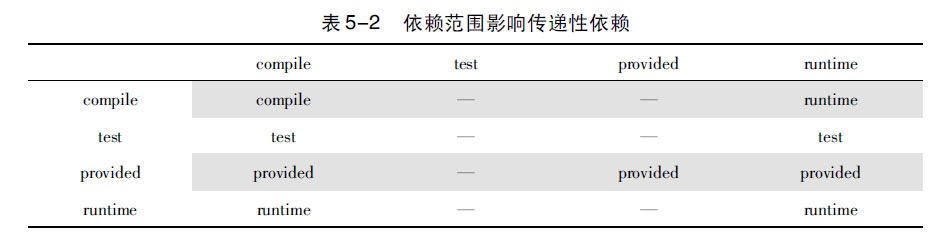

# Maven

- lifecycles > phases > goals

  Three built-in build **lifecycles**: `default`, `clean` and `site`.

    - The `default` lifecycle handles your project deployment, the `clean` lifecycle handles project cleaning, while
      the `site` lifecycle handles the creation of your project's web site.
    - For example, the `default` lifecycle comprises of the following **phases** (for a complete list of the lifecycle
      phases, refer to
      the [Lifecycle Reference](https://maven.apache.org/guides/introduction/introduction-to-the-lifecycle.html#Lifecycle_Reference)):
        - `validate` - validate the project is correct and all necessary information is available
        - `compile` - compile the source code of the project
        - `test` - test the compiled source code using a suitable unit testing framework. These tests should not require
          the code be packaged or deployed
        - `package` - take the compiled code and package it in its distributable format, such as a JAR.
        - `verify` - run any checks on results of integration tests to ensure quality criteria are met
        - `install` - install the package into the local repository, for use as a dependency in other projects locally
        - `deploy` - done in the build environment, copies the final package to the remote repository for sharing with
          other developers and projects.
    - `mvn [options] [<goal(s)>] [<phase(s)>]` : **plugin:goals** are bound to phases
    - [官网Lifecycle介绍](https://maven.apache.org/guides/introduction/introduction-to-the-lifecycle.html#Lifecycle_Reference)
      - 

## 传递性依赖

- `scope` of a package
    - `provided`: 参与编译，无需打包
    - `runtime`: 运行时需要，不需要编译
