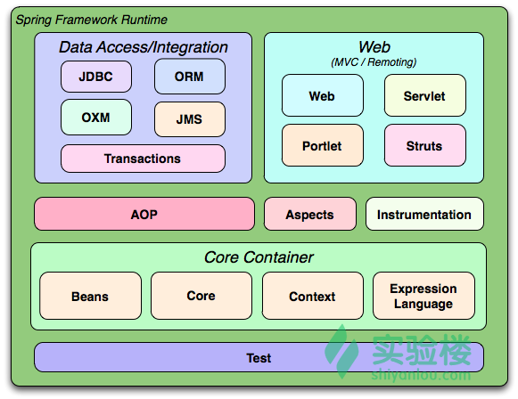

# 鸟瞰Spring

## Spring 历史
Spring 从 Spring Framework 开始，到现在已经变成一个生态，有着诸多子项目，例如Spring Boot、Spring Framework、Spring Data、Spring Cloud。其中 Spring Framework 是核心，Spring Boot 可以实现多个子项目的便捷整合。

* *Q:* Spring 算是从 Java EE 衍生并发展起来的？
* *A:* Spring Framework 并不是从 Java EE 衍生和发展起来的，而是作为一个独立的框架而开发的。然而，Spring Framework 是作为对 Java EE 的一种补充和替代方案而创建的，它的设计和功能在很大程度上是响应 Java EE 在某些领域的不足。
  * 在 Spring Framework 出现之前，Java EE（当时称为 J2EE）已经成为 Java 企业级应用的主流框架。然而，Java EE 的一些设计和实践（如企业 JavaBeans，EJB）被认为过于复杂和笨重，这导致了开发和部署的困难以及性能问题。
  * Spring Framework 在 2004 年首次发布，其目标就是提供一个更加简单、灵活和高效的方式来开发企业级 Java 应用。Spring 引入了诸如依赖注入（DI）和面向切面编程（AOP）等新的编程模型，并且提供了对各种数据访问技术（如 JDBC 和 ORM）的一致抽象，这使得许多开发者开始转向使用 Spring，许多开发者开始在 Java EE 应用中使用 Spring 来替代 EJB。例如，他们可以使用 Spring 的 DI 和 AOP 功能来构建业务逻辑组件，使用 Spring 的事务管理功能来处理事务，使用 Spring 的 JDBC 和 ORM 支持来进行数据访问。
  * 尽管 Spring Framework 在很大程度上是作为对 Java EE 的一种反应而开发的，但它并不依赖 Java EE。实际上，Spring 可以在 Java SE 环境中独立运行，也可以与 Java EE 技术集成。随着时间的推移，Java EE 和 Spring Framework 都在相互影响和学习，现在它们都是 Java 企业级应用的重要选项。

## Spring 核心原则
Spring Framework 的设计和架构是基于一些核心原则，其中一些最重要的原则包括：

1. **Inversion of Control (IoC)**：这是 Spring Framework 的核心，也是 Spring 的控制反转容器的基础。它将对象之间的依赖关系移交给了框架，而不是传统的方式，即由对象自己管理这些依赖关系。
2. **Dependency Injection (DI)**：这是实现 IoC 的一种方法，它允许对象通过构造函数、方法或字段接收依赖项。这使得对象之间的依赖关系更加松散，易于测试，并且提高了代码的可重用性。
3. **Aspect-Oriented Programming (AOP)**：Spring 提供了对面向切面编程的支持，这允许在不修改源代码的情况下，将横切关注点（如日志、事务管理、安全等）应用到特定的程序段。
4. **Convention over Configuration**：Spring 尽可能地采取了“约定优于配置”的原则。例如，Spring Boot 提供了许多预设的默认配置，使得开发者可以快速启动新的项目，而不需要进行大量的配置。
5. **Portability**：Spring Framework 设计为与特定的环境和第三方库无关，可以在多种环境下运行，包括不同的应用服务器和数据库。
6. **Testability**：Spring 的 IoC 容器和 DI 功能提供了良好的测试支持。它允许将真实的依赖替换为测试双，这使得单元测试和集成测试更加容易。
7. **Integration with existing technologies**：Spring 框架提供了与许多流行技术和框架的集成支持，包括 JPA、Hibernate、JMS、JDBC、OAuth、Security 等。

以上这些原则是 Spring Framework 的设计和架构的基础，并且引导了 Spring 的开发和进化。

## Spring Framework 组成
Spring Framework 是一个复杂的项目，包含许多模块和包。这些模块有自己的依赖关系。以下是 Spring Framework 的主要模块及其依赖关系的概述：

1. **spring-core**: 这是 Spring 框架的核心模块，包含 Spring 框架的核心工具类，它被其他所有的模块使用。这个模块也提供了 IoC 和 Dependency Injection（DI）的基础设施。
2. **spring-beans**: 是 Spring 中实现 IoC 的基础模块，它包含访问配置文件、创建和管理 bean 以及实现 IoC 的所有基本功能。BeanFactory 是这个模块中的一个核心接口，它定义了一个高级工厂，能够管理任何类型的对象。
3. **spring-context**: 建立在 core 和 beans 模块之上，它支持国际化（i18n），事件传播，资源加载和透明创建上下文（如 WebApplicationContext）。
4. **spring-expression**: 提供了强大的表达式语言来支持在运行时查询和操作对象图（Object Graph Navigation），建立在 context 模块之上。
5. **spring-aop**: 提供了面向切面编程的能力，包括 Spring IoC 容器的集成。它依赖于 core 和 beans 模块。
6. **spring-jdbc**: 提供了 JDBC 抽象层，它消除了冗长的 JDBC 编码和数据库厂商的错误代码解析。它依赖于 core 和 beans 模块。
7. **spring-tx**: 提供了编程式和声明式的事务管理，它可以应用于实现特定接口的类，也可以应用于所有的 POJO。它依赖于 core 和 beans 模块。
8. **spring-orm**: 提供了对 JPA，JDO 和 Hibernate 的集成，因此你可以选择使用哪一种技术。它依赖于 core，beans，jdbc 和 tx 模块。
9. **spring-web**: 提供了基础的 Web 集成特性，如多文件上传，使用 Servlet Listener 用于 IoC 集成等。它依赖于 core，beans 和 context 模块。
10. **spring-webmvc**: 或者叫作 Web-Servlet 模块，包含 Spring 的 Model-View-Controller(MVC) 和 REST Web 服务实现。它依赖于 web 模块。
11. **spring-webmvc-portlet**: 或者叫作 Web-Portlet 模块，提供了在 Portlet 环境下的 MVC 实现。它依赖于 web 和 webmvc 模块。

以上只是 Spring Framework 的一部分模块。Spring Framework 还包含许多其他模块，比如 spring-test（用于单元测试和集成测试）、spring-context-support（用于支持和集成第三方库和类库）等等。

请注意，这个描述是基于 Spring Framework 5.x 版本，后续版本可能会有一些变化。也请注意，具体的依赖关系可能会因为你的具体需求和应用类型（例如，Web 应用程序、企业级应用程序、微服务等）而有所不同。



* 核心容器：包括Core、Beans、Context、EL模块
  * Core模块：封装了框架依赖的最底层部分，包括资源访问、类型转换以及一些常用工具类
  * Beans模块：提供了框架的基础部分，包括IoC和DI。BeanFactory是容器核心，本质是“工厂设计模式”的实现，而且无需编程实现“单例设计模式”，单例完全由容器控制，并且提倡面向接口变成；所有应用程序对象及对象间关系由框架管理，从而真正从程序逻辑上把维护对象之间的依赖关系提取出来，所有依赖关系都由BeanFactory来维护。
  * Context模块：以Core和Beans为基础，集成Beans模块功能并添加资源绑定、数据验证、国际化、Java EE支持、容器生命周期、事件传播等；核心接口是ApplicationContext。
  * EL模块：提供强大的表达式语言支持。
* AOP、Aspects模块
  * AOP模块：Spring AOP模块提供了符合AOP Alliance规范的aspect-oriented programming实现，提供比如日志记录、权限控制、性能统计等通用功能和业务逻辑分离的技术，并且能动态的把这些功能添加到需要的代码中；这样各司其职，降低业务逻辑和通用功能的耦合。
  * Aspects模块：提供了对AspectJ的集成，它可以提供比Spring AOP更强大的功能。
* 数据访问/集成模块
  * 事务模块：用于Spring管理事务，无需在代码中进行事务控制，而且支持编程和声明性的事务管理。
  * JDBC模块：提供了一个JDBC的样例模版，可以消除传统冗余的JDBC编码还有必须的事务控制。
  * ORM模块
  * OXM模块：提供了一个对Object/XML映射实现，将Java对象映射成XML数据，或者将XML数据映射成Java对象。
  * JMS模块：用于JMS（Java Messaging Service），提供一套「消费生产者、消费消费者」模版用于更加简单的使用JMS，JMS用于在两个应用程序之间，或分布式系统中发送消息，进行异步通信。
* Web模块
  * Web模块：提供了基础的Web功能。
  * Servlet模块(spring-mvc)：提供了一个Spring MVC Web框架实现。Spring MVC框架提供了基于注解的请求资源注入、更简单的数据绑定、数据验证等及一套非常易用的JSP标签，完全无缝与Spring其他技术协作。
  * Struts模块：提供了与Struts无缝集成，Struts1.x与Struts2.x都支持。
* Test模块：Spring支持JUnit和TestNG测试框架。

## Spring Framework 与 Struts 2
* *Q:* Spring Framework 可以与 Struts 2 集成使用吗？
* *A:* 是的，Spring Framework 可以与 Struts 2 框架集成。
  * Struts 2 是一个用于创建企业级 Java web 应用程序的开源框架，它使用和提倡 MVC（Model-View-Controller）架构模式。而 Spring Framework 提供了许多企业级服务，如依赖注入（DI）、事务管理、数据访问等，这些服务可以很好地补充 Struts 2。
  * 在集成 Struts 2 和 Spring Framework 时，通常的做法是使用 Spring 的依赖注入功能来管理 Struts 2 的 Action 类。这允许你在 Action 类中方便地注入其他 Spring 管理的 bean，比如服务（Service）和数据访问对象（DAO）。
  * 例如，你可以在 Struts 2 的 `struts.xml` 配置文件中配置 Spring 插件，以便使用 Spring 的 IoC 容器来创建 Action 类：
      ```xml
      <struts>
          <!-- ... -->
          <constant name="struts.objectFactory" value="spring" />
          <!-- ... -->
      </struts>
      ```
    然后，你就可以在 Action 类中使用 `@Autowired` 注解来注入 Spring 管理的 bean：
      ```java
      public class MyAction extends ActionSupport {
          @Autowired
          private MyService myService;
      
          // ...
      }
      ```
  * 通过这种方式，你可以在 Struts 2 中利用 Spring 提供的各种功能，包括但不限于 DI、事务管理、数据访问等。

* *Q:* Spring Framework 5 还可以与 Struts2 集成使用吗？
* *A:* 在 Spring Framework 5 中，你依然可以将其与 Struts 2 集成。然而，你可能会遇到一些挑战和问题，因为这两个框架的发展和目标有所不同。
  * Spring Framework 5 对 Java EE 7 及以上版本有最佳支持，而且大力推广响应式编程模型，并与 Spring Boot 和 Spring Cloud 等项目更紧密地集成。在此背景下，Spring Framework 5 对于与一些旧的或者非响应式的 Web 框架的集成可能没有那么顺畅。
  * Struts 2，尽管已经有一段时间没有大的更新，但仍然是一个功能强大并且在业界得到广泛应用的 Web 框架。你可以将其与 Spring Framework 5 集成，但可能需要一些额外的工作来确保它们之间的兼容性。
  * 如果你正在寻找一个与 Spring Framework 5 更紧密集成、更现代化的 Web 框架，你可能会考虑使用 Spring MVC（它是 Spring Framework 的一部分）或者其他一些框架，如 Thymeleaf。然而，如果你有特定的需求或者已经有一些在 Struts 2 上的现有代码，那么你仍然可以尝试将其与 Spring Framework 5 集成。
