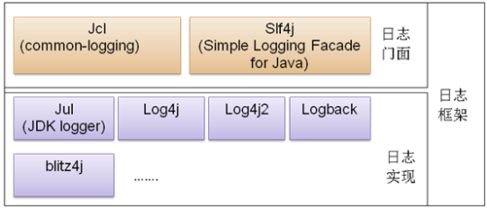

# 日志

## 日志门面
* Apache Commons Logging
* SLF4J
    

## 日志实现
* JUL (java.util.logging)
* Log4j
* Logback
    1. Logback Core：提供了日志的核心功能，如记录器、日志级别、日志事件等。
    2. Logback Classic：是Logback的具体实现，它实现了SLF4J的API，并提供了一些额外的功能，如异步日志记录、滚动文件等。
    3. Logback Access：提供了与Servlet容器集成的功能，用于记录HTTP请求和响应的访问日志。
* Log4j2
