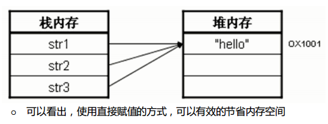
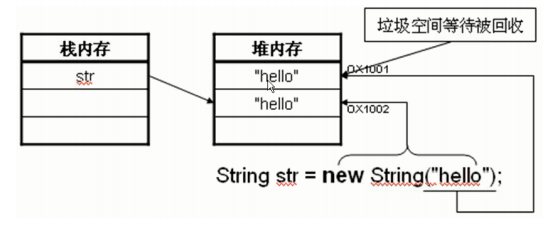

# 02.01 String类

## String 类的对象实例化

### 方式一

```java 
// 直接赋值 
public class StringDemo01 { 
    public static void main(String args[]) { 
        String name = "hiwangzi" ; // 实例化String对象 
        System.out.println("姓名：" + name) ; 
    }
}
```

### 方式二

```java
// 使用关键字 new 
public class StringDemo02 { 
    public static void main(String args[]) { 
        String name = new String("hiwangzi") ; // 实例化String对象 
        System.out.println("姓名：" + name) ; 
    }
}
```

## 两种实例化方法的比较

### 方式一

```java
public class StringDemo07 { 
    public static void main(String args[]) {
        String str1 = "hello" ; // 直接赋值 
        String str2 = "hello" ; // 直接赋值 
        String str3 = "hello" ; // 直接赋值 
        System.out.println("str1 == str2 --> " + (str1==str2)) ; // true 
        System.out.println("str1 == str3 --> " + (str1==str3)) ; // true 
        System.out.println("str2 == str3 --> " + (str2==str3)) ; // true 
    } 
}
```


### 方式二

```java
public class StringDemo08 { 
    public static void main(String args[]) { 
        String str1 = new String("hello") ; 
    } 
}
```


故：
使用直接赋值的方式只需要一个实例化对象即可，而使用new String()的方式则需要开辟两个内存对象空间。所以在开发中最好使用直接赋值的方式完成。

## 字符串的内容不可改变

```java
public class StringDemo09{ 
    public static void main(String args[]){ 
        String str = "hello" ; // 声明字符串 
        str = str + " world!!!" ; // 修改字符串 
        System.out.println("str = " + str) ; 
    } 
} 
// 输出：str = hello world!!!
```

表面上改变了字符串 str，而在内存中却并不如此。实际会在堆内存中生成如下字符串：
```
"hello"
"world!!!"
"hello world!!!"
```
所以实际上：
* 字符串的内容一旦声明则不可改变。
* 字符串内容的改变，实际上改变的是内存地址的引用关系。
开发中，应避免如下的应用：
```java
public class StringDemo10{ 
    public static void main(String args[]){ 
        String str1 = "LiXingHua" ; // 声明字符串对象 
            for(int i=0;i<100;i++){ // 循环修改内容 
                str1 += i ; // 字符串的引用不断改变 
        } 
        System.out.println(str1) ; 
    } 
}; 
```
因为：
这样的操作需要引用与值之间断开-连接100次才可以完成，性能很低，应该避免使用。
若想实现类似的操作，可以使用`StringBuffer`类。

## String 内容的比较

### 方式一：使用 == 进行比较（比较的是堆内存的地址）

```java
public class StringDemo04{ 
    public static void main(String args[]){ 
        String str1 = "hello" ; // 直接赋值 
        String str2 = new String("hello") ; // 通过new赋值 
        String str3 = str2 ; // 传递引用 
        System.out.println("str1 == str2 --> " + (str1==str2)) ; // false 
        System.out.println("str1 == str3 --> " + (str1==str3)) ; // false 
        System.out.println("str2 == str3 --> " + (str2==str3)) ; // true 
    } 
}; 
```
* 现在使用的判断相等，是判断地址空间是否相等，判断的是地址值。
* 如果要想判断其内容是否相等，则就需使用String类中提供的equals()方法。

### 方式二：使用 equals() 方法进行比较（比较的是字符串的内容）

```java
public class StringDemo04 { 
    public static void main(String args[]){ 
        String str1 = "hello" ; // 直接赋值 
        String str2 = new String("hello") ; // 通过new赋值 
        String str3 = str2 ; // 传递引用 
        System.out.println("str1 equals str2 --> " + (str1.equals(str2))) ; // true 
        System.out.println("str1 equals str3 --> " + (str1.equals(str3))) ; // true 
        System.out.println("str2 equals str3 --> " + (str2.equals(str3))) ; // true 
    } 
}; 
```
