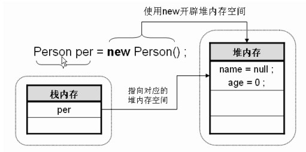
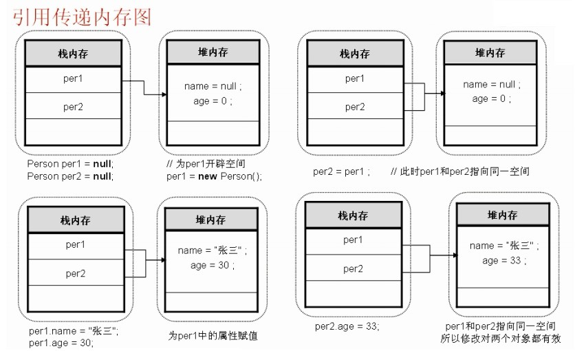
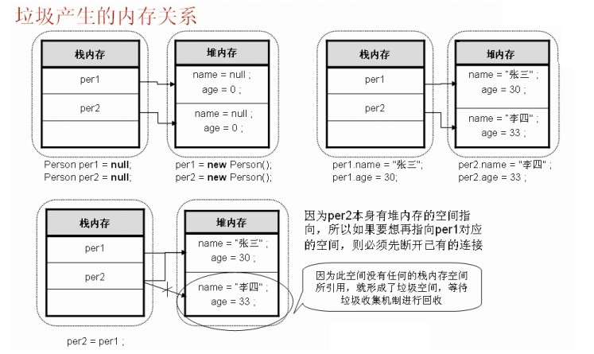

# 04.01 面向对象基础

## 面向对象的三大特征

* 封装（Encapsulation）：对外部不可见
* 继承（Inheritance）：扩展类的功能
* 多态（Polymorphism）：一个对象变量可以指示多种实际类型的现象被称为多态

## 关于重载（Overload）、重写（Override）、多态

* 重载(overload) 是在一个类里面，方法名字相同，而参数不同。返回类型可以相同也可以不同，但是考虑到程序设计的一致性，重载时**尽量**保证方法的返回值类型相同。
* 重写(override)：重写是子类对父类的允许访问的方法的实现过程进行重新编写。返回值和形参都不能改变。即外壳不变，核心重写。

  |区别点|重载方法|重写方法|
  |-----|------|------|
  |参数列表|必须修改|一定不能修改|
  |返回类型|可以修改，但最好相同|可以有可协变的返回类型|
  |异常|可以修改|可以减少或删除，一定不能抛出新的或者更广的异常|
  |访问|可以修改|一定不能做更严格的限制（可以降低限制）|
  > 参考 http://www.runoob.com/java/java-override-overload.html

* 关于重写（Override）的返回类型：
    * 返回类型不是签名的一部分，因此，在覆盖方法时，一定要保证返回类型的兼容性。允许子类将覆盖方法的返回类型定义为原返回类型的子类型。
    * 例如，假设`Employee`类有`public Employee getBuddy() {}`，在子类`Manager`中，可以按照如下所示的方式覆盖这个方法`public Manager getBuddy() {}`。这样就可以说，这两个`getBuddy`方法就有可协变的返回类型。
* **多态**是同一个行为（方法名）具有多个不同表现形式或形态的能力（实际执行效果）。多态性是对象多种表现形式的体现。
  * 多态的三个必要条件：
    * 继承
    * 重写
    * 父类引用指向子类对象

## 内存划分：对象创建之初

* 类属于引用传递类型，同样存在着“栈内存-堆内存”的引用关系

  

  ```java
  Person per = new Person();
  ```

  * 声明对象：`Person per`，栈内存中保存对象名，只开辟了栈内存的对象是无法使用的，必须有堆内存的引用才可以使用。
  * 实例化对象：`new Person()`，在堆中开辟空间，所有的内容都是默认值。

* 进一步拆分上面一行代码，可以用如下形式：

  ```java
  Person per = null;     // 声明对象
  per = new Person();    // 实例化对象
  ```

## 引用传递

* 引用保存在栈内存
* 属性保存在堆内存
* 方法保存在全局代码区（此区域中的内容是所有对象共享的）



注意：对象间的引用传递，实际上传递的就是**堆内存空间的使用权**。

## 垃圾产生与回收（GC）



## 关于类的一些其它要点

* 使用类的方法时，会***隐式包含一个参数***——方法名前的类对象（方法之中使用`this`调用），这被称为隐式(implicit)参数。其他参数称为显式(explicit)参数。
* [方法接收参数的形式是按值调用(call by value)](../03-01-数组的定义及使用.textbundle/text.md#3-使用方法交换变量值)。
* 可以通过「方法的签名(signature)」来完整地描述一个方法（方法名+参数类型，**不包含返回类型**），例如`String`类的`indexOf`方法
  * `indexOf(int)`
  * `indexOf(int, int)`
  * `indexOf(String)`
  * `indexOf(String, int)`
* 默认域的初始化
  * 如果没有初始化类中的域，将会被自动初始化为默认值（0、false或null）。
  * 但局部变量不可，必须明确地初始化方法中的局部变量。
* 类中代码执行顺序原则：
  * 静态优先（静态域、静态代码块）
  * 对于非静态，顺序为：域(初始化语句)、构造代码块（初始化块）、构造方法
  * 总结：**父类静态元素 -> 子类静态元素 -> 父类非静态元素 -> 子类非静态元素**
* 装箱和拆箱是**编译器**认可的，而不是虚拟机。编译器在生成类的字节码时，插入必要的方法调用。虚拟机只是执行这些字节码。

### 包

* 从编译器的角度来看，嵌套的包之间没有任何关系。
* `import java.time.*` 对代码的大小无负面影响，但会降低人可读性。
  * 👆 上面只能导入`java.time`下所有的类，不能导入其下的子包中的类（例如`java.time.format.DateTimeFormatter`），因为Java的导入语句不支持递归导入。
  * 在Java中实际上并不存在真正的"子包"的概念。Java的包是扁平的，而非层次性的。也就是说，即使一个包的名称是另一个包名称的前缀（如 com.example 和 com.example.sub），它们也被视为完全不同的包。
* 只能使用星号(`*`)导入 **一个** 包，而**不能**使用`import java.*`或`import java.*.*`导入以`java`为前缀的所有包。
* 在包中定位类是编译器的工作，字节码中使用完整的包名引用其他类。
* `import static java.lang.System.*`这样的写法可以导入`System`类的静态方法和静态域，可以直接使用而无需加类名前缀。
