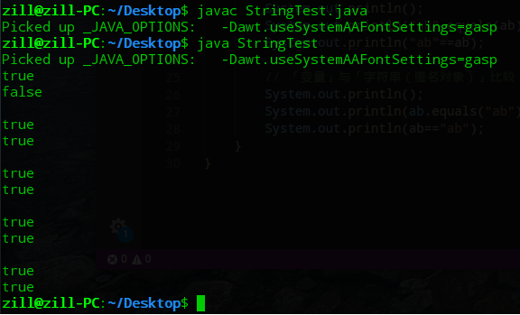

# 04.04 匿名对象与字符串缓冲池

## 匿名对象

* 匿名对象：只在堆内存中开辟空间，不存在栈内存的引用。
* 由于匿名对象没有对应的栈内存引用所指向，所以使用一次之后，就等待被垃圾回收了。
* 例：一个单独的字符串就是一个 String 的匿名对象。`System.out.println("Hi");`

## 字符串缓冲池

```java
public class Test {
    public static void main(String[] args) {
        String str = "hello" ;
        System.out.println("hello".equals(str)) ; // true
        System.out.println("hello" == str); // true
        // String 池：Java为了优化字符串操作 提供了一个缓冲池；
        // str 指向字符串 "hello", 第二句中字符串 "hello" ，为同一指向。
        // 这是因为字符串在常量池中已经存在，第二句中字符串 "hello" 就不再开辟新空间。
        // 所以不管是 equals 比较内容， == 比较内存地址都为 true。
        // 但请不要使用这种方式比较字符串，这种表现并不是规定的行为。
    }
}
```

* 下面的代码验证了我去「XXXX」面试时真的是乱吹🙈：

```java
/*
* 当时我以为 JVM 的缓冲池可以实现“变量(a)连接字符串("b")可以与"ab"使用同一个堆内存”
* 但是事实是并不可行
*/
public class StringTest {
    public static void main(String[] args) {
        String ab = "ab";
        String a = "a";
        // 「变量」与「变量连接字符串（匿名对象）」比较
        System.out.println(ab.equals((a + "b"))); // true
        System.out.println(ab == (a + "b")); // false
        System.out.println();
        // 「字符串（匿名对象）」与「字符串（匿名对象）连接字符串（匿名对象）」比较
        System.out.println("ab".equals(("a" + "b"))); // true
        System.out.println("ab" == ("a" + "b")); // true
        System.out.println();
        // 「变量」与「字符串（匿名对象）连接字符串（匿名对象）」比较
        System.out.println(ab.equals(("a" + "b"))); // true
        System.out.println(ab == ("a" + "b")); // true
        System.out.println();
        // 「字符串（匿名对象）」与「变量」比较
        System.out.println("ab".equals(ab)); // true
        System.out.println("ab" == ab); // true
        System.out.println();
        // 「变量」与「字符串（匿名对象）」比较
        System.out.println(ab.equals("ab")); // true
        System.out.println(ab == "ab"); // true
    }
}
```



* 时光恍惚，当时还在用着 Deepin（上图）
* 现在看来（2018年4月13日），道理也并不复杂
  * 像 `"a"+"b"` 这种代码，在编译的时候必然可以优化为 `"ab"`。在 Java 中，字符串的 + 运算符是在编译时处理的。编译器会将所有的字符串常量表达式（即，所有的由字符串常量通过 + 运算符连接起来的表达式）替换为一个单一的字符串常量。
  * 但 `a+"b"` 显式的开辟了两个堆内存空间（分别存储`"a"`, `"b"`），并且还需要再次开辟堆空间存储连接后的值。`a`是字符串变量，`+`运算符会在运行时处理。
* > What is String pool in Java
  >
  > This prints true (even though we don't use equals method: correct way to compare strings)
  >
  > ```java
  > String s = "a" + "bc";
  > String t = "ab" + "c";
  > System.out.println(s == t);
  > ```
  > When compiler optimizes your string literals, it sees that both `s` and `t` have same value and thus you need only one string object. It's safe because `String` is **immutable** in Java.
  >
  > As result, both `s` and `t` point to the same object and some little memory saved.
  >
  > Name 'string pool' comes from the idea that all already defined string are stored in some 'pool' and before creating new String object compiler checks if such string is already defined.
  >
  > 参考：https://stackoverflow.com/questions/3801343/what-is-string-pool-in-java#3801355
