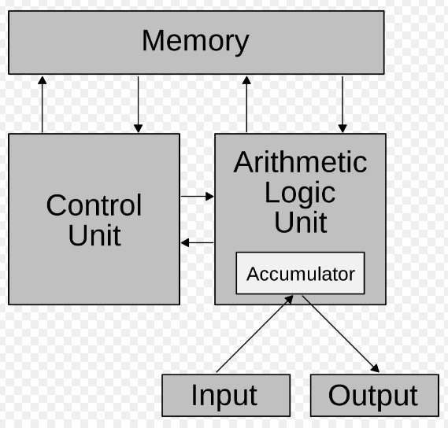
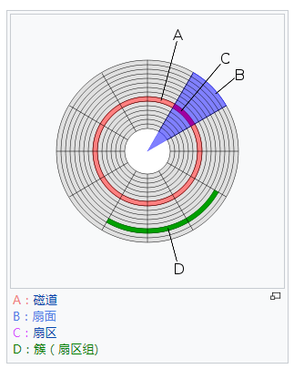

# 计算机概论

1. 计算机的五大部分：输入单元、输出单元、CPU（控制单元(Control Unit)、算数逻辑单元(ALU)）、内存。

    

2. CPU 的架构
    * 精简指令集（Reduced Instruction Set Computing, RISC），例如：SPARC，ARM
    * 复杂指令集（Complex Instruction Set Computing, RISC），例如：Intel/AMD x86 架构

3. CPU
    * 外频：CPU 与外部组件进行数据传输时的速度
    * 内频：CPU 内部用来加速工作性能的一个倍数
    * 注：
      * 两者相乘为 CPU 的频率速度
      * 超频：将CPU的倍频或外频更改为更高，但倍频通常被锁定，经常被修改的是外频。

4. 主板芯片组
    * 北桥：系统总线（速度相对较快），内存传输的主要信道
    * 南桥：I/O 总线，连接硬盘、USB、网卡等设备
    * 注：
      * 北桥所支持的频率称为前端总线速度（Front Side Bus, FSB），而每次传送的位数则是总线宽度。

5. CPU 每次能够处理的数据量称为字组大小（word size）
    * 计算机被称为“32位”或“64位”的主要依据
    * 早期“32位”的CPU中，因为CPU每次能够解析的数据量有限，因此由内存传来的数据量就有所限制，即导致了“32位”CPU最多只能支持到4GB内存

6. 内存主要组件 动态随机访问内存（Dynamic Random Access Memory, DRAM）
    * CPU 内部第二层缓存（L2 Cache）使用静态随机访问内存（Static Random Access Memory, SRAM）

7. 计算机的分类
    * 超级计算机（Super Computer）
    * 大型计算机（Mainframe Computer）
    * 迷你计算机（Mini Computer）
    * 工作站（Workstation）
    * 微型计算机（Micro Computer）

8. 计算机常用的计量单位

    容量一般采用二进制，速度一般采用十进制

    |进位制|kilo|mega|giga|tera|peta|exa|zetta|
    |---------|----|--------|------|-----|-----|-----|-------|
    |binary|1024|1024K|1024M|1024G|1024T|1024P|1024E|
    |decimal|1000|1000K|1000M|1000G|1000T|1000P|1000E|

9. 磁盘

    
    > 图自 [簇 - 维基百科，自由的百科全书](https://zh.wikipedia.org/wiki/%E7%B0%87)

    磁盘分割格式：
    * MBR：主引导记录（Master Boot Record）
    * GPT：GUID磁盘分割表（GUID Partition Table），全局唯一标识磁盘分区表

10. 操作系统

    操作系统的重点在于管理计算机的所有活动以及驱动系统中的所有硬件。

    

    内核（Kernel）的功能：
    * 系统调用接口（System call interface）
    * 程序管理（Process control）
    * 内存管理（Memory management）
    * 文件系统管理（Filesystem management）
    * 设备驱动（Device driver）