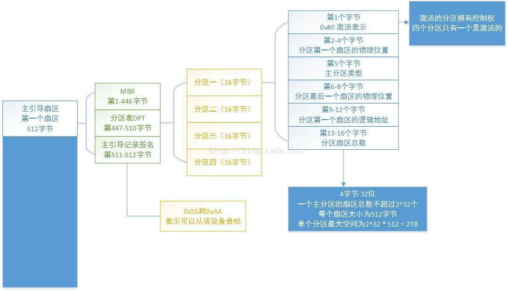

# 磁盘分区与系统启动流程

* Everything is a file.
* 常见硬件对应于 Linux 下的文件（/dev目录下）

    |装置|装置在Linux内的档名|
    |----|----------------|
    |SCSI/SATA/U盘硬盘机|/dev/sd[a-p]|
    |U盘|/dev/sd[a-p]（与SATA相同）|
    |VirtI/O界面|/dev/vd[a-p]（用于虚拟机内）|
    |打印机|25针: /dev/lp[0-2]; USB: /dev/usb/lp[0-15]|
    |鼠标|PS2: /dev/psaux; USB: /dev/usb/mouse[0-15]|
    |CDROM/DVDROM|/dev/scd[0-1]（通用）; /dev/sr[0-1]（通用，CentOS较常见）|
    |当前CDROM/DVDROM|/dev/cdrom|
    |当前的鼠标|/dev/mouse|

## MBR 分区方式

* 硬盘的第一个扇区主要记录了两个重要的信息，分别是：
  * 主要启动记录区(Master Boot Record, MBR)：可以安装启动管理程序的地方，有446 bytes
  * 分割表(partition table)：记录整块硬盘分割的状态，有64 bytes

* 关于磁盘分区表(partition table)：
  * 磁盘分区的最小单位是磁柱。
  * 在分割表所在的64 bytes容量中，总共分为四组记录区，每组记录区记录了该区段的启始与结束的磁柱号码。

* 假设下面的硬盘文件名为/dev/hda，那么这四个分区的文件名就如下所示：

  

  * P1: /dev/hda1
  * P2: /dev/hda2
  * P3: /dev/hda3
  * P4: /dev/hda4

* 以上提到的四个分区指的是主分区，如果需要，可以通过扩展分区来实现：

  

  * 在上图中，四个主分区记录区仅使用其中两个，P2通过扩展分区，分配出五个逻辑分区。
  * 扩展分配的目的是**使用额外的磁区来记录分割信息，扩展分配本身并不能被拿来格式化。**
    * 其在Linux系统中的文件名如下：
      * P1: /dev/hda1
      * P2: /dev/hda2
      * L1: /dev/hda5
      * L2: /dev/hda6
      * L3: /dev/hda7
      * L4: /dev/hda8
      * L5: /dev/hda9
    * 其中没有出现/dev/hda3与/dev/hda4，是因为前面四个数字保留给主分区/扩展分区使用。

* 小总结：
  * 主要分割与扩展分配最多可以有四笔(硬盘的限制)
  * 扩展分配最多只能有一个(操作系统的限制)
  * 逻辑分割是由扩展分配持续切割出来的分割槽；
  * 能够被格式化后，作为数据存取的分割槽为主要分割与逻辑分割。扩展分配无法格式化；
  * 逻辑分割的数量依操作系统而不同，在Linux系统中，SATA硬盘最多有11个逻辑分割(5号到15号)。
  * MBR的缺点：
    * 操作系统无法识别大于 2.2T 以上的磁盘容量；(计算方式参看下图([图片来源](https://www.zhihu.com/question/57728474/answer/372322174))，❓但仍有疑问，究竟是分区限制还是全盘限制 2T 呢？)
      
    * MBR 仅有一个区块，若被破坏后，无法或很难恢复；
    * 存放 boot loader 的区块仅有 446 bytes，无法容纳较多的代码。

## GUID partition table, GPT 分区方式

* 过去一个扇区大小为512bytes，而目前已经出现了4k的扇区设计。为了兼容于所有的硬盘，在扇区的定义上，大多使用逻辑区块地址（Logical Block Address, LBA）来处理。GPT将硬盘所有区块以此LBA（预设为512bytes）来规划，第一个LBA称为LBA0。

* 与MBR仅仅使用第一个512bytes来记录不同，GPT使用了34个LBA区块来记录硬盘分割信息，同时整个硬盘的最后33个LBA被用来作为另一个备份。

  

  * LBA0（MBR兼容区块）：
    * 与MBR模式类似，也分为两部分，一部分是与之前446bytes相似的区块，存储第一阶段的boot loader程序。但在原本的磁盘分割表记录区中，仅仅放入一个特殊标志分割，以此表明当前为GPT分区方式。
  * LBA1（GPT表头记录）：
    * 这个部分记录了分割表本身的位置与大小，同时记录了备份用的GPT分割放置的位置，以及校验码（CRC32）。操作系统可以根据校验码判断GPT是否正确，若有错误，则可以取得备份来恢复。
  * LBA2-33（实际记录分割记录信息处）：
    * 从LBA2区块开始，每个LBA都可以记录4个分割记录，所以在默认情况下，可以记录4*32=128个记录。每一个记录除了记录所需要的标志码与相关记录以外，还**分别**提供了64bits来记录开始/结束的区块号码。因此对于每个的分区来说，最大容量限制在「2^64 × 512bytes = 2^63 × 1Kbytes = 2^33 × TB = 8 ZB 」

## 系统启动流程（BIOS + MBR/GPT）

简单的说，整个启动流程到操作系统之前的动作应该是这样的：

* BIOS：启动主动运行的固件，会认识第一个可启动的装置；
* MBR：第一个可启动装置的第一个磁区内的主要启动记录区块，内含启动管理程序；
* 启动管理程序(boot loader)：可读取核心文件来运行的软件；
* 核心文件：开始操作系统的功能...

关于第二点，如果分区方式为GPT的话，BIOS同样可以在MBR兼容区块（LBA0）读取到boot loader程序，如果boot loader可以识别GPT分区的话，就可以正常启动系统。

由于MBR仅有446 bytes，所以boot loader非常精简，其主要任务是：

* 提供菜单：使用者可以选择不同的启动项目，这也是多重启动的重要功能！
* 加载核心文件：直接指向可启动的程序区段来开始操作系统；
* 转交其他loader：将启动管理功能转交给其他loader负责。

正是因为有第三点的功能，才能实现「多系统」功能。

举例，计算机只有一个硬盘，分为四个分区，其中第一、二分区分别安装了Windows与Linux。如何在启动时选择启动哪个操作系统呢？

假设MBR内安装的是可以同时认识Windows与Linux操作系统的启动管理程序，整个流程就如下图所示：

  

MBR的启动管理程序提供两个菜单，菜单一(M1)可以直接加载Windows的核心文件来启动； 菜单二(M2)则是将启动管理工作交给第二个分割槽的启动磁区(boot sector)。

当使用者在启动的时候选择菜单二时， 那么整个启动管理工作就会交给第二分区的启动管理程序了。 当第二个启动管理程序启动后，该启动管理程序内(上图中)仅有一个启动菜单，因此就能够使用Linux的核心文件来启动。

* 小总结：
  * 每个分区都拥有自己的启动磁区(boot sector)
  * 图中的系统分区为第一及第二分区，
  * 实际可启动的核心文件是放置到各分区内的！
  * loader只会认识自己的系统分区内的可启动核心文件，以及其他loader而已；
  * loader可直接指向或者是间接将管理权转交给另一个管理程序。

## 系统启动流程（UEFI + GPT）

事实上，BIOS 并不能识别 GPT，其是通过 GPT 的兼容实现（LBA0）来加载 boot loader。同时，BIOS仅仅为16位程序，功能较弱。因此后来出现了 UEFI(Unified Extensible Firmware Interface) 这个可扩展的界面。其基本上可以说是一个低级层次的小型操作系统。

|比较项目|传统 BIOS|UEFI|
|-------|--------|----|
|使用程序语言|汇编语言|C 语言|
|硬件资源控制|使用中断 (IRQ) 管理; 不可变的内存存取; 不可变得输入/输出存取|使用驱动程序与协定|
|处理器运行环境|16 位元|CPU 保护模式|
|扩展方式|通过 IRQ 连接|直接载入驱动程序|
|第三方厂商支持|较差|较好且可支持多平台|
|图形化能力|较差|较好|
|內建简化操作系统前环境|不支持|支持|

另外，与 BIOS 相比，虽然 UEFI 可以直接读取 GPT 的分割表，不过最好依然拥有 BIOS boot 的分区支持（LBA0）。同时为了兼容 Windows，并提供其他第三方厂商所使用的 UEFI 程序存储空间，必须格式化一个 vfat 的文件系统，大约提供 512MB 到 1G 左右的容量，以便让其他 UEFI 程序执行较为方便。

## 关于挂载（mount）

* Linux 的目录树结构
  

* 文件系统与目录树的关系

  * 所谓的「挂载」就是利用一个目录当成进入点，将磁盘分区的数据放置在该目录下； 也就是说，进入该目录就可以读取该分区的意思。这个动作我们称为『挂载』，那个进入点的目录我们称为『挂载点』。

  

上图中假设硬盘分为两个分区，partition 1是挂载到根目录，而partition 2则是挂载到/home这个目录。 这也就是说，当数据放置在/home内的各次目录时，数据是放置到partition 2的，如果不是放在/home底下的目录， 那么数据就会被放置到partition 1。

其实判断某个文件在那个partition底下是很简单的，透过反向追踪即可。以上图来说， 当我想要知道/home/vbird/test这个文件在那个partition时，由test --> vbird --> home --> /，看那个『进入点』先被查到那就是使用的进入点了。 所以test使用的是/home这个进入点而不是/。