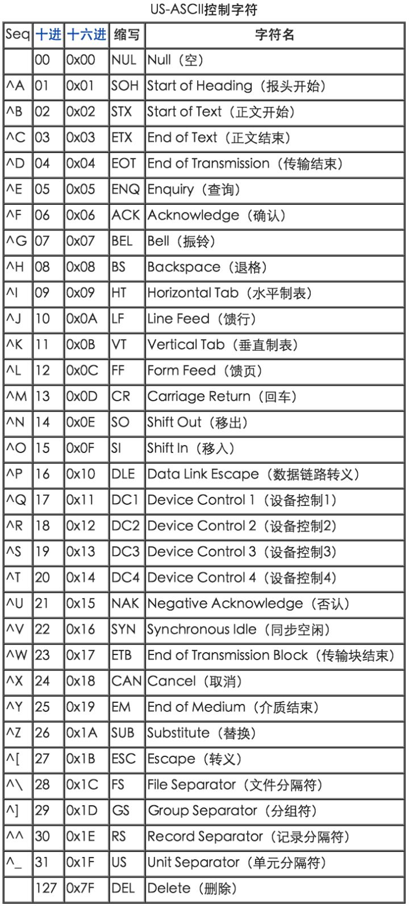

# Unix 键盘的使用

## `Ctrl` 修饰键

* `<Ctrl-A>`、`C-a`、`^A`
* 常用组合：
  * `^H` erase 删除最后一个键入的字符
  * `^W` werase 删除最后一个键入的单词
  * `^U` kill 删除整行

## Unix 键盘信号

* Unix 使用了一组键盘信号，不同形式的按键可以映射发送出标准的信号。
* Unix 可以使用特定的信号控制正在运行的程序的操作。例如，`intr`(interrupt，中断)信号可以用来终结程序，而按下`<Ctrl-C>`就可以发送`intr`信号（对于大多数终端来说），即`<Ctrl-C>`字符映射到`intr`信号上。

## `<Backspace>` 与 `<Delete>`

* 一系列的混乱：`^H`表示`erase`，`^?`可以发送`DEL`代码
* 现在PC的`<Delete>`键盘不映射以上两种信号
* 远程主机 `^H` 不映射到`erase`，则会发生无法使用 `^H` 删除字符的现象，解决方法：
  * 使用 `^W`删除整个单词，或 `^X/^U` 删除整行
  * 向远程主机发送 `^?` 键（`<Ctrl-Backspace>`或`<Option-Backspace>`）
  * 修改连接远程主机的程序的设置，设置`<Backspace>`键发送`^H`还是发送`^?`
  * 改变远程主机的映射，将`^H`而不是`^?`映射到`erase`信号上，`stty erase ^H`

## Unix 控制字符

## 其他信号

* `intr`：通常使用`<Ctrl-C>`
* `quit`：通常是`<Ctrl-\>`，在以前，它不仅停止程序，而且还会告诉Unix系统为此时内存重的内容制作一份副本，其存储在一个磁芯文件（core file）。
* `stop`、`start`：`stop`通常是`<Ctrl-S>`，这个信号告诉Unix临时停止屏幕显示；然后可以使用`start`（通常是`^Q`）继续屏幕显示（刚刚暂停打印的内容会全部显示）。（这两个按键选择的历史：Teletype ASR33，`^S`发送XON码打开纸带阅读机，`^Q`发送XOFF码关闭纸带阅读机）
* `eof`：end of file，`<Ctrl-D>`
* 可以使用`stty -a`查看所有键映射

## 关于`LF`与`CR`

* 返回字符（`CR`）=`^M`
* 换行字符（`LF`）=新行字符=`^J`
* 一般而言，文件之中每行文本必须以一个新行字符结束
* 在终端按下`<Reture>`键时，会发送一个返回字符，Unix会自动地将其改变为新行字符
* 在终端显示数据时，每行必须以“返回+新行”结束，因此当数据从文件发送到终端显示时，Unix自动地将每一行末尾的新行字符改变为“返回+换行字符”
