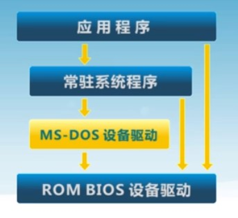
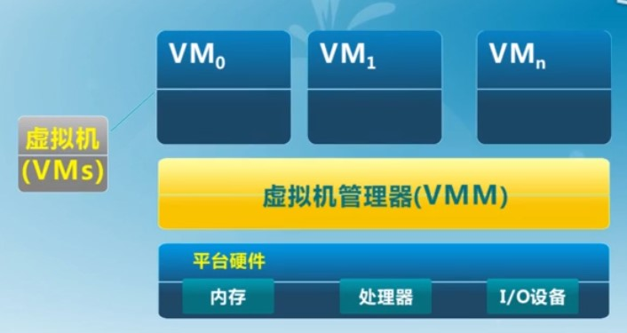

# 操作系统概述

## OS Kernel 的特征

* 并发
* 共享：宏观上「同时」访问，微观上互斥共享
* 虚拟：利用多道程序技术，把一个物理实体变为若干个逻辑对应
* 异步
  * 程序的执行不是一贯到底，而是走走停停，向前推进速度不可预知
  * 只要运行环境相同，OS 应保证程序的运行结果也相同

## 操作系统的演变

* 单用户系统（人工操作 '45 ~ '55）
* 批处理系统（'55 ~ '65）
* 多程序系统（通道、中断）（交替条件：上一个主动让出）（'65 ~ '80）
* 分时操作系统（定时中断以复用CPU）（'70 ~ ）
* 个人计算机：每个用户一个系统
* 分布式计算机：每个用户多个系统

## 操作系统的结构

### 简单结构

* 没有拆分为模块
* 接口与功能并没有很好的分离

### 分层结构

* OS 分为多层
  * 每层建立在低层上
  * 最底层（layer 0）是硬件
  * 最上层（layer N）是用户界面
* 使用模块化，每一层仅使用更低一层的功能和服务

### 微内核结构（Microkernel）

* 尽可能把内核功能转移到用户空间，内核只负责进程间通信和硬件支持
* 用户模块间的通信使用消息传递
* 好处：灵活、安全
* 缺点：性能

### 外核结构（Exokernel）

* 内核只负责资源的分配、保护与隔离，资源的管理任务交由应用
* 程序链接到操作系统库（libOS）实现操作系统抽象

### 虚拟机管理器（VMM）

* 虚拟机管理器将单独的机器接口转换为很多的虚拟机，每个虚拟机都是一个原始计算机系统的有效副本，并能完成所有的处理器指令。

