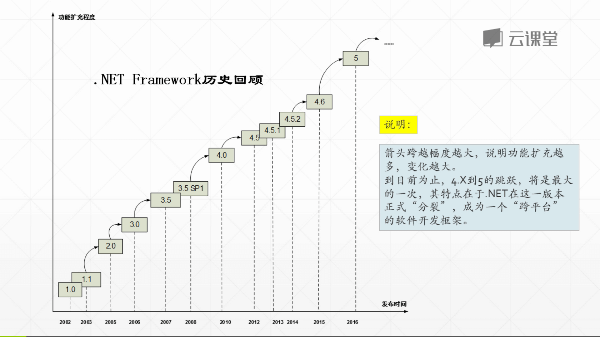

> 这是 2018年4月16日 记录的笔记，最开始写于博客园，[原文链接](http://www.cnblogs.com/hiwangzi/p/6616987.html)。

开始学习这门课程，是源自一次无意间的发现。上一周时看到[金老师的博客](http://jinxuliang.com/MainWebSite)，觉得内容非常不错，这才开始了这门课程的学习。

> [面向对象软件开发实践之基本技能训练 - 网易云课堂](http://mooc.study.163.com/course/BIT-1000003016)
>
> 这门课能告诉他们：一个有用的软件到底是如何诞生的，我们在学校里学的操作系统、数据结构等专业课程到底在开发中是怎样应用的……

以下是本课程第一单元的笔记：

## 工具

### .NET Reference Source

在此之前，有一次也想查看微软类库的源代码，可在 Visual Studio 中使用 F12 可以查看到的，仅仅只是定义，并没有对应的实现。那时还在想，难道是微软仅仅只是开放定义给开发人员。后来在网络上也没有搜索到相关内容（那时不知道如何描述，也没有找到合适的人请教），直到在这门课程中看到金老师的演示，才了解到微软的 .NET Framework 框架源码是完全开放的。

查看方式有两种：

1. 直接在 [.NET Reference Source](https://referencesource.microsoft.com/) 网站中在线浏览。
  

2. 通过配置，在 Visual Studio 中调试 .NET Framework 源码。具体配置方法参考：
    * [微软开放了.NET 4.5.1的源代码](http://www.infoq.com/cn/news/2014/02/microsoft-net-source-code)
    * [.NET Framework 4.5.1 已正式开源](http://www.xcode.me/more/open-net-framework-451)
    * [配置Visual Studio 以调试.net framework的源代码](http://edu.cnzz.cn/201412/95492de5.shtml)

## ildasm

IL 反汇编程序是 IL 汇编程序 (Ildasm.exe) 的配套工具。Ildasm.exe 可利用包含中间语言 (IL) 代码的可移植可执行 (PE) 文件，并创建适合输入到 Ilasm.exe 的文本文件。此工具自动随 Visual Studio 一起安装。

命令行方式使用文档说明：[Ildasm.exe（IL 反汇编程序）](https://msdn.microsoft.com/zh-cn/library/f7dy01k1(v=vs.110).aspx)

如果已经安装了 Visual Studio 的话，可以在这个目录（
C:\Program Files (x86)\Microsoft SDKs\Windows\v10.0A\bin\NETFX 4.6.1 Tools）下找到这个程序。实际情况取决于 Visual Studio 的版本，所以路径中的版本数字也可能会有所不同。

### ilspy

ILSpy is the open-source .NET assembly browser and decompiler.

这个工具可以帮助我们将 .NET 可执行程序反汇编出 C# 源代码。官网地址：http://ilspy.net/

## 关于 .NET

未完待续...