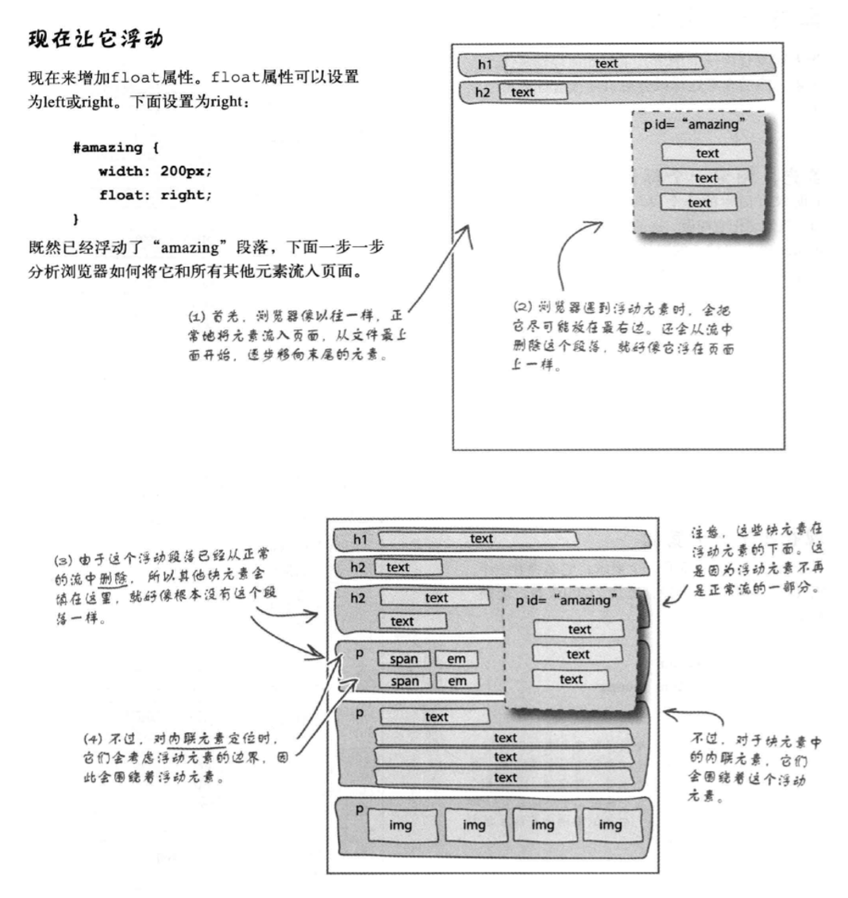
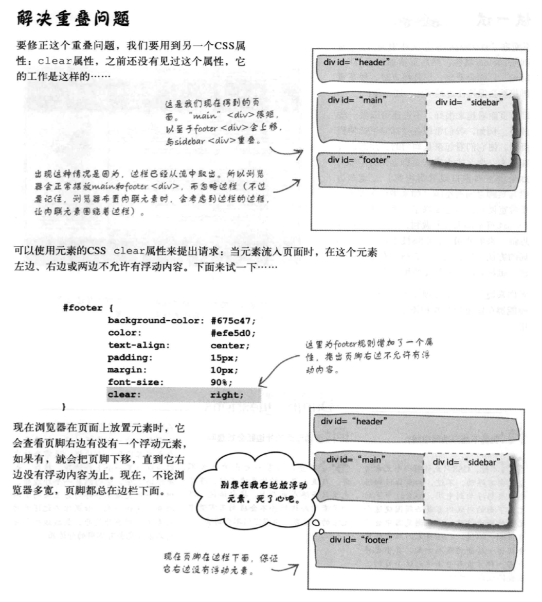

# Head First HTML 与 CSS 笔记

## 使用流（Flow）

* 流实际上就是浏览器在页面摆放HTML元素所用的方法，从上到下沿着元素流逐个显示所遇到的每个元素。
* 块元素：会在每个块元素之间加一个换行。
  
* 内联元素：在水平方向上相互挨着，总体上会从左上方流向右下方。
  
* 集成二者：
  

* “流”与“盒”模型
  * 并排放置两个内联元素时，会考虑到外边距。（例：左边元素外边距10像素，右边元素外边距20像素，那它们之间就会有30像素空间）
  * 上下放置两个块元素时，会将外边框折叠，使用其中较大的一个作为二者之间距离。
  * TODO 那内联元素一行显示不下，变成两行，上下距离是多少呢？

## 浮动元素

* 假设设置 `float` 属性为 `right`
* 浏览器会尽量将其放置在最右边，并将其从流中删除
* 其他元素会向前占位填充
* 但内联元素会考虑浮动元素的边界，围绕着浮动元素。
* 注意：要浮动一个元素，必须为这个元素设置一个宽度。

* 使用 `clear` 可以设置该元素的左、右或两边不允许有浮动内容。

  
