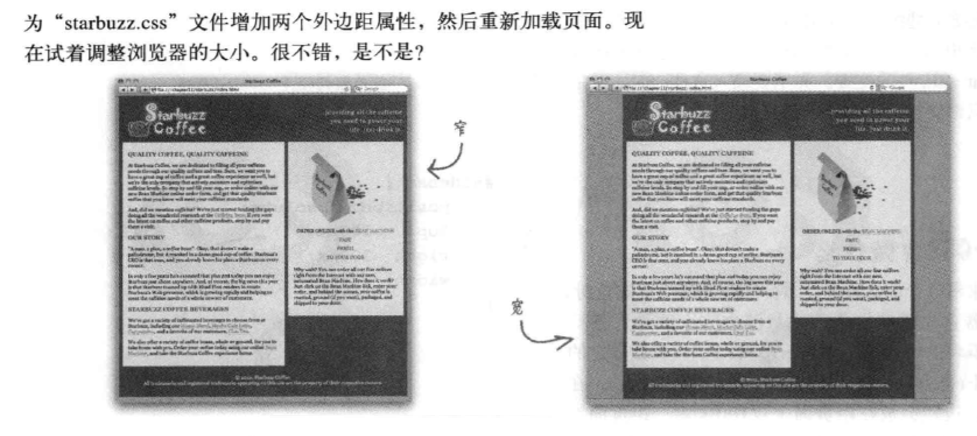

# Head First HTML 与 CSS 笔记

## 冻结布局

* 之前采用的设计都成为流体布局（liquid layouts）：无论怎样将浏览器宽度调整，布局都会扩展，填满整个浏览器。
* 冻结布局（frozen layouts）：冻结布局会锁定元素，当用户调整屏幕大小时，设计仍将保持原样。
    ```html
    <body>
        <div id="allcontent"> <!-- 增加一个新的div，包围body里的所有其他元素 -->
              HTML 中的其他内容
        </div>
    </body>
    ```
    ```css
    #allcontent {
      width: 800px;
      padding: 5px 0px;
      background-color: #675c47;
    }
    ```

## 流体与冻结之间的状态：凝胶（Jello）

```css
#allcontent {
    width: 800px;
    padding: 5px 0px;
    background-color: #675c47;
    margin-left: auto;
    margin-right: auto;
}
```

* 效果：
  