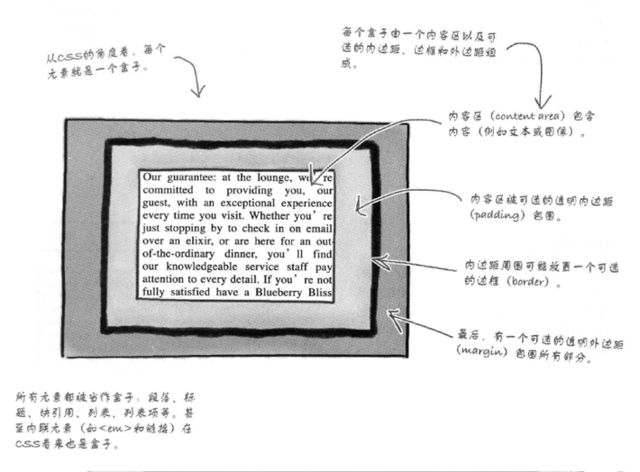
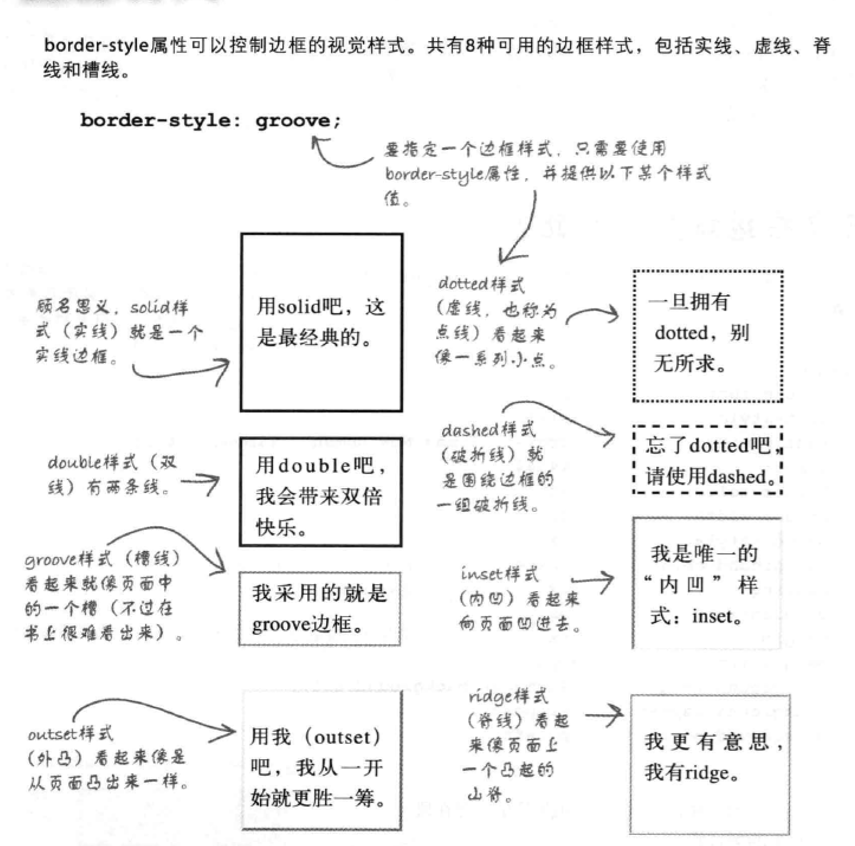

# Head First HTML 与 CSS 笔记

## 盒模型



## 元素背景图像

* 元素的背景图像可以通过 `background-image` 属性指定
    ```css
    background-image: url(images/background.git); /*也可以使用完整的url地址*/
    ```
* 默认情况下，背景图像会“平铺”，使用`background-repeat: no-repeat;`属性可以设置为不重复。可以设置的值有：
  * `no-repeat`
  * `repeat-x`：水平方向上重复
  * `repeat-y`
  * `inherit`：按父元素的设置来处理

* 可以通过`background-position: top left;` 指定背景图像位置为左上角。

## 边框样式简介



* `border-width` 指定边框宽度（thin, medium, thick 或像素）
* `border-color` 指定边框颜色
* `border-radius` 指定圆角
* 指定某一边的边框（bottom, left, right 同理）
    ```css
    border-top-color
    border-top-style
    border-top-width
    border-top-left-radius
    ```

## 类选择器与id选择器

* 在 CSS 中的使用：
    ```css
    .specials { /*类*/
      color: red;
    }
    #footer { /*id*/
      color: green;
    }
    ```

* 类名与id都可以包含字母、数字以及“_”（不可以有空格）。但类名要以一个字母开头，id可以以字母或数字开头。

* id必须是唯一的。

## 媒体查询

* 可以根据需要，在html中为不同的设备，使用不同的样式表，例如：
    ```html
    <link href="mobile.css" rel="stylesheet" media="screen and (max-device-width: 480px)>
    ```
* 或者直接在CSS中增加媒体查询
    ```css
    @media screen and (min-width: 481px) {
      /*如果屏幕宽度大于480px，就会使用这些规则*/
    }
    @media screen and (max-width: 480px) {
      /*如果屏幕宽度小于等于480px，就会使用这些规则*/
    }
    body {
      /*其他规则会应用于所有的页面*/
    }
    ```

* 除了 `max-width` 与 `min-width` 以外，[还有很多媒体属性](https://www.w3schools.com/css/css3_mediaqueries.asp)。
  * `max-width` 指的是浏览器宽度
  * `max-device-width` 指的是设备实际屏幕宽度
