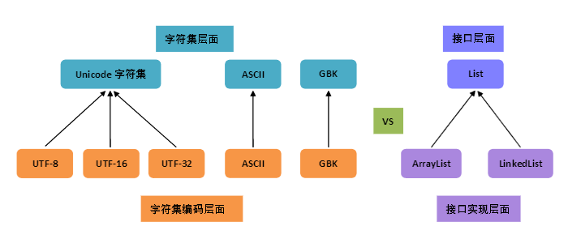

# Unicode 笔记

## 「字符集」与「字符集编码」

* charset: character set
* encoding: charset encoding



## 字符的编号（code）在Unicode中：码点（code point）

* Unicode provides a unique number for every character.
* 目前码点的范围 U+0000~U+10FFFF（Unicode 官方表示以后不再扩充）
* 代码单元（code unit）：指一种转换格式（UTF）中最小的一个分隔。
  * UTF-8：一字节为一个单元，UTF-8可以包含一个单元、二个单元、三个单元及四个单元
  * UTF-16：两字节为一个单元，UTF-16可以包含一个单元、二个单元
  * UTF-32：四字节为一个单元，UTF-32只包含一个单元这一种即可

## 三种编码方案

* UTF-8：变长，1-4 字节；
* UTF-16：变长，2 或 4 字节；
* UTF-32：定长，4 字节。

## UTF-16 为何变长了

* UTF-16 的前身 UCS-2 是 16 位定长的编码，它与码点在形式上完全一样
* 但后来字符扩充，目前的码点数 17 × 65536 ≈ 111 万，而 16 位定长最多 65536 个字符

## 变长（Variable-length）的编码方案

* 利用高位作区分
* 利用代理区作区分

## Unicode 的平面

* Unicode 共有码点数 17 × 65536，为了便于管理，每 65536 个码点划分为一个平面。

  

* BMP（Basic Multilingual Plane 基本多语言平面），也叫 Plane 0，日常用到的字符绝大多数都落在此平面。（UTF-16只需要两字节编码此平面字符）
* SP（Supplementary Planes 增补平面），码点值超过了 U+FFFF。（UTF-16需要四字节编码这些字符）


## Unicode 与 UTF 转换

* UTF 即是 Unicode 转换格式（Unicode (or UCS) Transformation Format）。

### UTF-32

* 直接对码点补0，补够32位即可。
* 简单但占空间太大。

### UTF-8

* 可以有 1，2，3，4 四种字节组合。
* 采用的即是「高位保留」的方式区分不同变长。

  

* 转换举例

  

  > 如果看到一串的 16 进制有如下的形式：**E**X XX XX **E**X XX XX…每三个三个字节前面都是 E 打头，那么它很可能就是一串汉字的 UTF-8 编码了。

### UTF-16

* UTF-16 是一种变长的 2 或 4 字节编码模式。
* BMP 内的字符使用 2 字节编码，其它平面使用 4 字节组成代理对来编码。
* 其采用的便是「代理区」形式区分不同变长。
* BMP 内的代理区
  * 高代理区（D800-DBFF）
  * 低代理区（DC00-DFFF）

## BOM

* BOM = Byte Order Mark

  |Encoding|Representation (hexadecimal)|
  |--------|----------------------------|
  |UTF-8|EF BB BF|
  |UTF-16 (BE)|FE FF|
  |UTF-16 (LE)|FF FE|
  |UTF-32 (BE)|00 00 FE FF|
  |UTF-32 (LE)|FF FE 00 00|

* BOM 其实就是 ```U+FEFF``` (zero-width non-breaking space)这个码点，```EF BB BF```是该码点在 UTF-8 下的编码。
* 该码点用作 BOM 后，Unicode 不再建议解释为“零宽度非换行空格”，建议用 ```U+2060``` (Word Joiner)来代替。
* UTF-16 和 UTF-32 的处理单元分别是 2 个字节和 4 个字节，在 C 语言中的定义就决定了这两个超过 8 位的整数需要考虑存储和网络传输的字节序。而 UTF-8 的编码是以 1 个字节为单位处理的，需要考虑下一位时就地址 +1，不会受 CPU 大小端的影响。（参考：[为什么 UTF-8 不存在字节序的问题？ - 孙笑凡的回答 - 知乎](https://www.zhihu.com/question/55140986/answer/142938758)）

## 参考资料

* [字符集与编码（一）——charset vs encoding](https://xiaogd.net/%E5%AD%97%E7%AC%A6%E9%9B%86%E4%B8%8E%E7%BC%96%E7%A0%81%EF%BC%88%E4%B8%80%EF%BC%89-charset-vs-encoding/)
* [字符集与编码（二）——编号 vs 编码](https://xiaogd.net/%E5%AD%97%E7%AC%A6%E9%9B%86%E4%B8%8E%E7%BC%96%E7%A0%81%EF%BC%88%E4%BA%8C%EF%BC%89-%E7%BC%96%E5%8F%B7vs%E7%BC%96%E7%A0%81/)
* [字符集与编码（三）——定长与变长](https://xiaogd.net/%E5%AD%97%E7%AC%A6%E9%9B%86%E4%B8%8E%E7%BC%96%E7%A0%81%EF%BC%88%E4%B8%89%EF%BC%89-%E5%AE%9A%E9%95%BF%E4%B8%8E%E5%8F%98%E9%95%BF/)
* [字符集与编码（四）——Unicode](https://xiaogd.net/%E5%AD%97%E7%AC%A6%E9%9B%86%E4%B8%8E%E7%BC%96%E7%A0%81%EF%BC%88%E5%9B%9B%EF%BC%89-unicode/)
* [字符集与编码（五）——代码单元及 length 方法](https://xiaogd.net/%E5%AD%97%E7%AC%A6%E9%9B%86%E4%B8%8E%E7%BC%96%E7%A0%81%EF%BC%88%E4%BA%94%EF%BC%89-%E4%BB%A3%E7%A0%81%E5%8D%95%E5%85%83%E5%8F%8A-length-%E6%96%B9%E6%B3%95/)
* [字符集与编码（七）——BOM](https://xiaogd.net/%E5%AD%97%E7%AC%A6%E9%9B%86%E4%B8%8E%E7%BC%96%E7%A0%81%EF%BC%88%E4%B8%83%EF%BC%89-bom/)