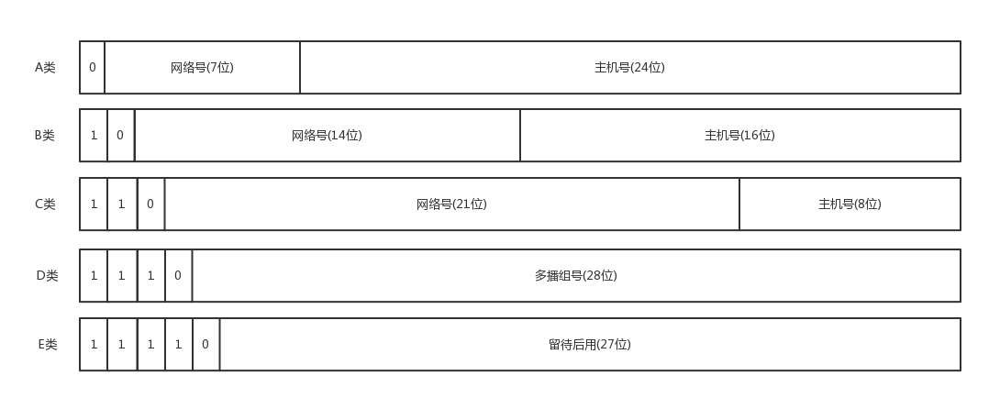

# CIDR（无类型域间选路）

## 旧式五类地址划分



## CIDR

* 网络号、主机号不固定位数划分
  * 广播地址：主机号部分全为1
  * 子网掩码与IP地址按位AND运算，得到网络号
* 虽然现在不再区分A、B、C等网络类别，但其中保留的IP地址段这个概念仍然使用
  

## `ip addr` 命令

```
1: lo: <LOOPBACK,UP,LOWER_UP> mtu 65536 qdisc noqueue state UNKNOWN group default 
    link/loopback 00:00:00:00:00:00 brd 00:00:00:00:00:00
    inet 127.0.0.1/8 scope host lo
       valid_lft forever preferred_lft forever
    inet6 ::1/128 scope host 
       valid_lft forever preferred_lft forever
2: eth0: <BROADCAST,MULTICAST,UP,LOWER_UP> mtu 1500 qdisc pfifo_fast state UP group default qlen 1000
    link/ether fa:16:3e:c7:79:75 brd ff:ff:ff:ff:ff:ff
    inet 10.100.122.2/24 brd 10.100.122.255 scope global eth0
       valid_lft forever preferred_lft forever
    inet6 fe80::f816:3eff:fec7:7975/64 scope link 
       valid_lft forever preferred_lft forever
```

* `scope`：`global`接口可以对外，`lo`接口仅供本机通信
* `link/ether fa:16:3e:c7:79:75 brd ff:ff:ff:ff:ff:ff`：MAC地址，6个字节
* `<BROADCAST,MULTICAST,UP,LOWER_UP>`：称为`net_device flags`，网络设备的状态标识。
  * `BROADCAST`：表示网络接口有广播地址，可以发送广播包；
  * `MULTICAST`：表示可以发送多播包；
  * `UP`：表示网卡处于启动的状态；
  * `LOWER_UP`：表示L1是启动的，即网线连通；
  * `mtu 1500`：最大传输单元1500字节，以太网默认值；
  * `qdisc pfifo_fast`：qdisc为queueing discipline（排队规则）
    * 最简单的为`pfifo`，不对数据包做任何处理，先入先出；
    * `pfifo_fast`队列分为三个band，分别使用先进先出规则，band 0的优先级最高，如果band 0里面有数据包，band 1中的数据就不会被处理。（数据包是按照服务类型(Type of Service, TOS)被分配到3个band里面的，TOS是IP头里面的一个字段，表示当前包的优先级）