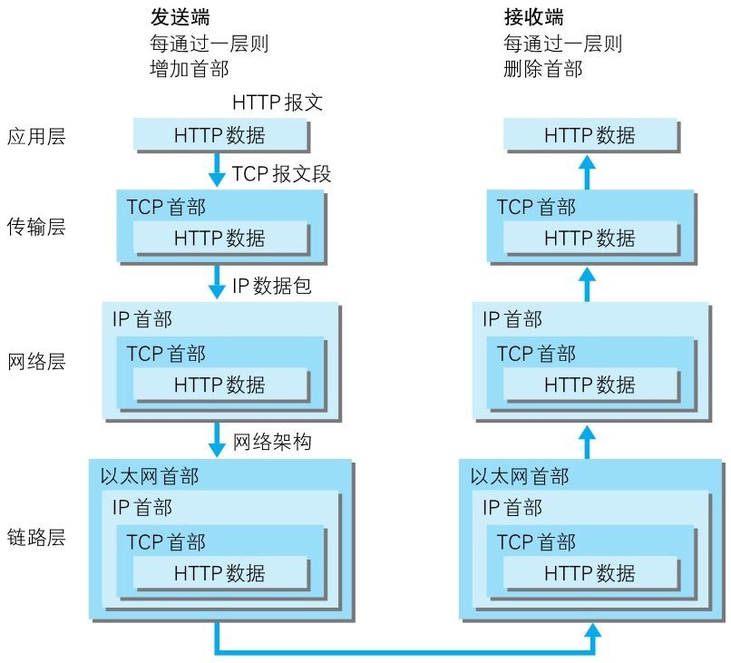
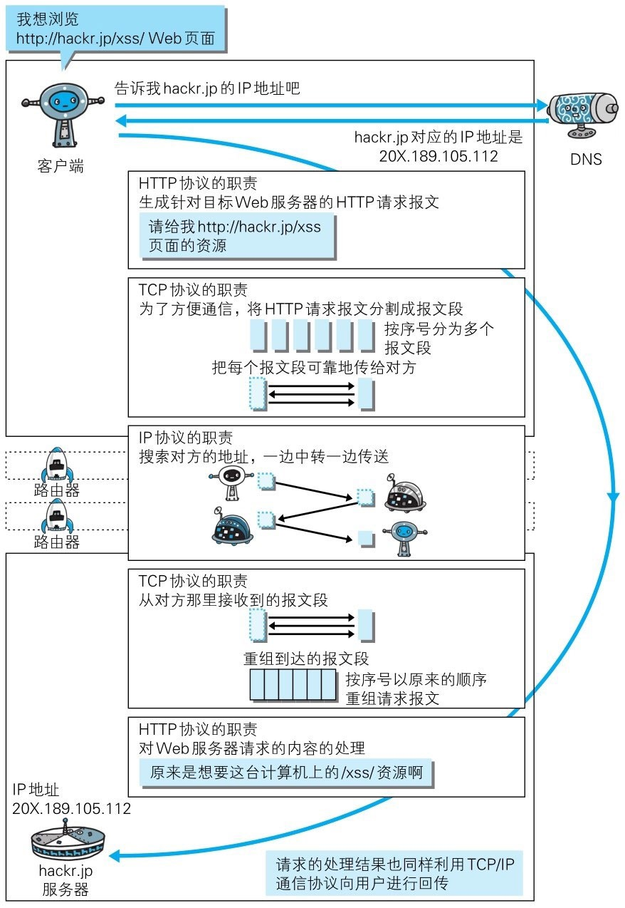

# Web 基础

三项构建技术：
* HTML：页面的文本标记语言
* HTTP：文档传输协议
* URL：指定文档所在地址

## 一些概念

* HTTP（HyperText Transfer Protocol）：通常被译为“超文本传输协议”，但严谨应译为“超文本转移协议”
    * 传输（transport）：从端到端可靠地搬运比特，属于 TCP/IP 中传输层（transport layer）协议处理的事
    * 转移（transfer）：在客户端-服务器之间转移一些带有操作语义的原语，来执行某些操作，属于TCP/IP中应用层的事务。

* HTTP 版本
    * HTTP/0.9：并没有作为正式标准被建立
    * HTTP/1.0：公布于 1996 年 5 月，记录于 RFC1945
    * HTTP/1.1：公布于 1997 年 1 月，最初标准为 RFC 2068，后来发布修订版 RFC2616，目前主流被使用的版本
    * HTTP/2.0

* TCP/IP 协议族

    |||
    |-|-|
    |应用层|（FTP、DNS、HTTP...）
    |传输层|用于提供处于网络连接中的两台计算机之间的数据传输（TCP、UDP）|
    |网络层|用来处理在网络上流动的数据包（IP）|
    |数据链路层|用来处理连接网络的硬件部分|

* HTTP over TCP/IP 通信传输图解：

    

* 各种协议与 HTTP 协议的关系：

    

* URI 和 URL
    * URI：Uniform Resource Identifier
    * URL：Uniform Resource Locator
    * URI 用字符串标识某一互联网资源，而 URL 表示资源的地点（互联网上所处的位置）所以说，URL 是 URI 的子集。

* URI 的举例分析

    