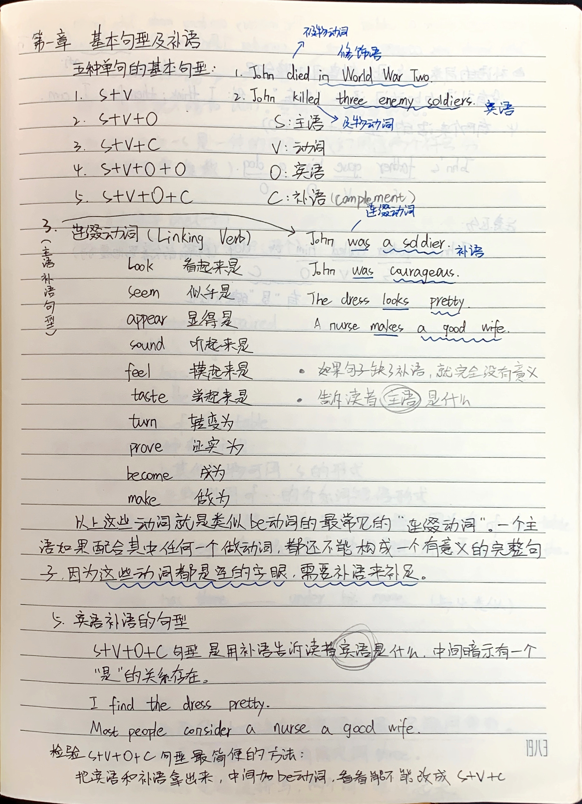
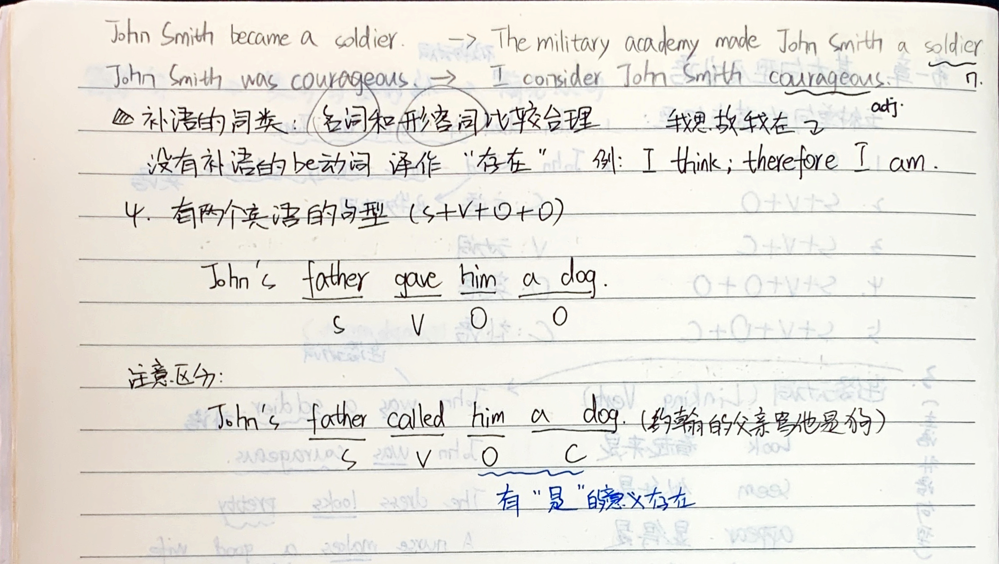

# 基本句型

## 五种单句的基本句型

1. S + V (John died in World War Two.)
2. S + V + O (John killed three enemy soldiers.)
3. S + V + C (John was a soldier.)
4. S + V + O + O (John's father gave him a dog.)
5. S + V + O + C (John's father called him a dog.)

